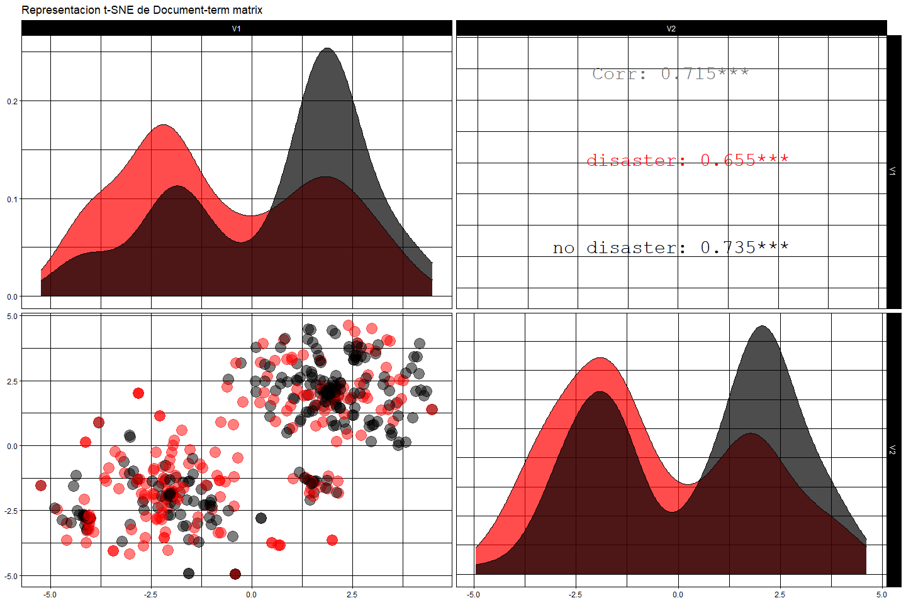

<style>
.list-group-item.active, .list-group-item.active:focus, .list-group-item.active:hover {
    background-color: #F84040;
}
</style>


# Resumen

El objetivo de este notebook es representar oraciones mediante el modelo **GloVe**. Este modelo normalmente se utiliza para representar palabras con muy buenos resultados, en este caso se hace una ajuste de los vectores de cada palabra para lograr un vector de cada frase tratada.

Una vez establecido el modelo vectorial **GloVe**, se determina un modelo **XGBTree** para predecir la veracidad de desastres informados en varios textos. 

Para ello se utilizan dos datasets, el primero es un dataset con mensajes informando desastres en *twitter*, con esta base de datos se implementa el **XGBTree**. 

El segundo dataset es grande y se utiliza para generar el modelo **GloVe**, esto es para lograr generalizar mejor con **GloVe**.


# GloVe (Global Vectors)

**GloVe** , que viene de Global Vectors, es un modelo para representar palabras distribuidas. El modelo es un algoritmo de aprendizaje no supervisado para obtener representaciones vectoriales de palabras. Esto se logra mapeando palabras en un espacio significativo donde la distancia entre palabras esta relacionada con la similitud semantica. El entrenamiento se realiza en estadisticas globales de co-ocurrencia palabra-palabra agregadas de un corpus, y las representaciones resultantes muestran interesantes subestructuras lineales del espacio vectorial de palabras [(Wikipedia)](https://en.wikipedia.org/wiki/GloVe_(machine_learning)).

El algoritmo **GloVe** consta de los siguientes pasos:

1- Recopilacion de estadisticas de co-ocurrencia de palabras en una forma de matriz de co-ocurrencia $X$. Cada elemento $X_{ij}$ de dicha matriz representa la frecuencia con la que aparece la palabra $i$ en el contexto de la palabra $j$. Por lo general, se escanea el corpus de la siguiente manera: para cada termino se buscan terminos de contexto dentro de un area definida por un window-size antes del termino y un window.size despues del termino. Tambien se da menos peso a las palabras mas distantes, usualmente usando esta formula:

$$decay = \frac{1}{offset}$$

2- Definir restricciones suaves para cada par de palabras:

$$w_{i}^{T}w_j+b_i+b_j = log(X_{ij})$$

Donde:

  - $w_i$: vector palabra principal.
  - $w_j$: vector palabra contexto.
  - $b_i$: sesgo palabra principal.
  - $b_j$: sesgo palabra contexto.


3- Definir una funcion de costos:


$$J=\sum_{i=1}^{V}\sum_{j=1}^{V}f(X_{ij})(w_{i}^{T}w_j+b_i+b_j-logX_{ij})^2$$

Donde $f$ es una funcion de ponderacion que ayuda a evitar el aprendizaje solo de pares de palabras extremadamente comunes. Los autores de **GloVe** eligen la siguiente funcion:


$$f(X_{ij})=\begin{cases} (\frac{X_{ij}}{x_{max}})^\alpha & \text{si X_{ij} > XMAX} \\1 & \text{en otro caso}\end{cases}$$

Para mayor informacion revisar ["GloVe: Global Vectors for Word Representation"](https://nlp.stanford.edu/pubs/glove.pdf), ["GloVe Word Embeddings"](http://text2vec.org/glove.html).


# Exploracion Datasets.

## Real or Not? NLP with Disaster Tweets.


Twitter es un importante canal de comunicacion en tiempos de emergencia. La ubicuidad de los telefonos inteligentes permite a las personas anunciar una emergencia que estan observando en tiempo real. Debido a esto, mas agencias estan interesadas en monitorear *Twitter* (es decir, organizaciones de ayuda ante desastres y agencias de noticias). Sin embargo, no siempre esta claro si las palabras de una persona realmente anuncian un desastre. Este dataset representa una muestra de mensajes de emergencia en *Twitter* identificando si los desastres informados son reales o no.

A continuacion se muestran las primeras 6 observaciones del dataset, que muestra que consta de 5 columnas:

- **id**: un identificador unico para cada tweet. 
- **keyword**: una palabra clave en particular del tweet (puede estar en blanco).
- **location**: la ubicacion desde la que se envio el tweet (puede estar en blanco).
- **text**: el texto del tweet. 
- **target**: indica si un tweet trata sobre un desastre real (1) o no (0). 


```r
dataDisaster <- fread("train.csv")
htmlTable(dataDisaster %>% head(),
          caption = "Tabla 1. Muestra del dataset.",
          tfoot = "&dagger; primeras 6 observaciones",
          col.rgroup = c("none","#FC7C7C"),
          css.cell = "padding-left: .5em; padding-right: .2em;")
```

<table class='gmisc_table' style='border-collapse: collapse; margin-top: 1em; margin-bottom: 1em;' >
<thead>
<tr><td colspan='6' style='text-align: left;'>
Tabla 1. Muestra del dataset.</td></tr>
<tr>
<th style='border-bottom: 1px solid grey; border-top: 2px solid grey;'> </th>
<th style='font-weight: 900; border-bottom: 1px solid grey; border-top: 2px solid grey; text-align: center;'>id</th>
<th style='font-weight: 900; border-bottom: 1px solid grey; border-top: 2px solid grey; text-align: center;'>keyword</th>
<th style='font-weight: 900; border-bottom: 1px solid grey; border-top: 2px solid grey; text-align: center;'>location</th>
<th style='font-weight: 900; border-bottom: 1px solid grey; border-top: 2px solid grey; text-align: center;'>text</th>
<th style='font-weight: 900; border-bottom: 1px solid grey; border-top: 2px solid grey; text-align: center;'>target</th>
</tr>
</thead>
<tbody>
<tr>
<td style='padding-left: .5em; padding-right: .2em; text-align: left;'>1</td>
<td style='padding-left: .5em; padding-right: .2em; text-align: center;'>1</td>
<td style='padding-left: .5em; padding-right: .2em; text-align: center;'></td>
<td style='padding-left: .5em; padding-right: .2em; text-align: center;'></td>
<td style='padding-left: .5em; padding-right: .2em; text-align: center;'>Our Deeds are the Reason of this #earthquake May ALLAH Forgive us all</td>
<td style='padding-left: .5em; padding-right: .2em; text-align: center;'>1</td>
</tr>
<tr style='background-color: #fc7c7c;'>
<td style='padding-left: .5em; padding-right: .2em; background-color: #fc7c7c; text-align: left;'>2</td>
<td style='padding-left: .5em; padding-right: .2em; background-color: #fc7c7c; text-align: center;'>4</td>
<td style='padding-left: .5em; padding-right: .2em; background-color: #fc7c7c; text-align: center;'></td>
<td style='padding-left: .5em; padding-right: .2em; background-color: #fc7c7c; text-align: center;'></td>
<td style='padding-left: .5em; padding-right: .2em; background-color: #fc7c7c; text-align: center;'>Forest fire near La Ronge Sask. Canada</td>
<td style='padding-left: .5em; padding-right: .2em; background-color: #fc7c7c; text-align: center;'>1</td>
</tr>
<tr>
<td style='padding-left: .5em; padding-right: .2em; text-align: left;'>3</td>
<td style='padding-left: .5em; padding-right: .2em; text-align: center;'>5</td>
<td style='padding-left: .5em; padding-right: .2em; text-align: center;'></td>
<td style='padding-left: .5em; padding-right: .2em; text-align: center;'></td>
<td style='padding-left: .5em; padding-right: .2em; text-align: center;'>All residents asked to 'shelter in place' are being notified by officers. No other evacuation or shelter in place orders are expected</td>
<td style='padding-left: .5em; padding-right: .2em; text-align: center;'>1</td>
</tr>
<tr style='background-color: #fc7c7c;'>
<td style='padding-left: .5em; padding-right: .2em; background-color: #fc7c7c; text-align: left;'>4</td>
<td style='padding-left: .5em; padding-right: .2em; background-color: #fc7c7c; text-align: center;'>6</td>
<td style='padding-left: .5em; padding-right: .2em; background-color: #fc7c7c; text-align: center;'></td>
<td style='padding-left: .5em; padding-right: .2em; background-color: #fc7c7c; text-align: center;'></td>
<td style='padding-left: .5em; padding-right: .2em; background-color: #fc7c7c; text-align: center;'>13,000 people receive #wildfires evacuation orders in California </td>
<td style='padding-left: .5em; padding-right: .2em; background-color: #fc7c7c; text-align: center;'>1</td>
</tr>
<tr>
<td style='padding-left: .5em; padding-right: .2em; text-align: left;'>5</td>
<td style='padding-left: .5em; padding-right: .2em; text-align: center;'>7</td>
<td style='padding-left: .5em; padding-right: .2em; text-align: center;'></td>
<td style='padding-left: .5em; padding-right: .2em; text-align: center;'></td>
<td style='padding-left: .5em; padding-right: .2em; text-align: center;'>Just got sent this photo from Ruby #Alaska as smoke from #wildfires pours into a school</td>
<td style='padding-left: .5em; padding-right: .2em; text-align: center;'>1</td>
</tr>
<tr style='background-color: #fc7c7c;'>
<td style='padding-left: .5em; padding-right: .2em; background-color: #fc7c7c; border-bottom: 2px solid grey; text-align: left;'>6</td>
<td style='padding-left: .5em; padding-right: .2em; background-color: #fc7c7c; border-bottom: 2px solid grey; text-align: center;'>8</td>
<td style='padding-left: .5em; padding-right: .2em; background-color: #fc7c7c; border-bottom: 2px solid grey; text-align: center;'></td>
<td style='padding-left: .5em; padding-right: .2em; background-color: #fc7c7c; border-bottom: 2px solid grey; text-align: center;'></td>
<td style='padding-left: .5em; padding-right: .2em; background-color: #fc7c7c; border-bottom: 2px solid grey; text-align: center;'>#RockyFire Update => California Hwy. 20 closed in both directions due to Lake County fire - #CAfire #wildfires</td>
<td style='padding-left: .5em; padding-right: .2em; background-color: #fc7c7c; border-bottom: 2px solid grey; text-align: center;'>1</td>
</tr>
</tbody>
<tfoot><tr><td colspan='6'>
&dagger; primeras 6 observaciones</td></tr></tfoot>
</table>

De estas variables se utilizan solo **text** como caracteristica para predecir **target**. Se observa que el dataset tiene **7613** observaciones, donde **42.97%** de las observaciones son desastres reales.


```r
dataDisaster <- dataDisaster %>% select(text, target)
htmlTable(dataDisaster %>% summary(),
          caption = "Tabla 2. Distribucion de variables.",
          tfoot = "",
          col.rgroup = c("none","#FC7C7C"),
          css.cell = "padding-left: .5em; padding-right: .2em;")
```

<table class='gmisc_table' style='border-collapse: collapse; margin-top: 1em; margin-bottom: 1em;' >
<thead>
<tr><td colspan='3' style='text-align: left;'>
Tabla 2. Distribucion de variables.</td></tr>
<tr>
<th style='border-bottom: 1px solid grey; border-top: 2px solid grey;'> </th>
<th style='font-weight: 900; border-bottom: 1px solid grey; border-top: 2px solid grey; text-align: center;'>    text</th>
<th style='font-weight: 900; border-bottom: 1px solid grey; border-top: 2px solid grey; text-align: center;'>    target</th>
</tr>
</thead>
<tbody>
<tr>
<td style='padding-left: .5em; padding-right: .2em; text-align: left;'></td>
<td style='padding-left: .5em; padding-right: .2em; text-align: center;'>Length:7613       </td>
<td style='padding-left: .5em; padding-right: .2em; text-align: center;'>Min.   :0.0000  </td>
</tr>
<tr style='background-color: #fc7c7c;'>
<td style='padding-left: .5em; padding-right: .2em; background-color: #fc7c7c; text-align: left;'></td>
<td style='padding-left: .5em; padding-right: .2em; background-color: #fc7c7c; text-align: center;'>Class :character  </td>
<td style='padding-left: .5em; padding-right: .2em; background-color: #fc7c7c; text-align: center;'>1st Qu.:0.0000  </td>
</tr>
<tr>
<td style='padding-left: .5em; padding-right: .2em; text-align: left;'></td>
<td style='padding-left: .5em; padding-right: .2em; text-align: center;'>Mode  :character  </td>
<td style='padding-left: .5em; padding-right: .2em; text-align: center;'>Median :0.0000  </td>
</tr>
<tr style='background-color: #fc7c7c;'>
<td style='padding-left: .5em; padding-right: .2em; background-color: #fc7c7c; text-align: left;'></td>
<td style='padding-left: .5em; padding-right: .2em; background-color: #fc7c7c; text-align: center;'></td>
<td style='padding-left: .5em; padding-right: .2em; background-color: #fc7c7c; text-align: center;'>Mean   :0.4297  </td>
</tr>
<tr>
<td style='padding-left: .5em; padding-right: .2em; text-align: left;'></td>
<td style='padding-left: .5em; padding-right: .2em; text-align: center;'></td>
<td style='padding-left: .5em; padding-right: .2em; text-align: center;'>3rd Qu.:1.0000  </td>
</tr>
<tr style='background-color: #fc7c7c;'>
<td style='padding-left: .5em; padding-right: .2em; background-color: #fc7c7c; border-bottom: 2px solid grey; text-align: left;'></td>
<td style='padding-left: .5em; padding-right: .2em; background-color: #fc7c7c; border-bottom: 2px solid grey; text-align: center;'></td>
<td style='padding-left: .5em; padding-right: .2em; background-color: #fc7c7c; border-bottom: 2px solid grey; text-align: center;'>Max.   :1.0000  </td>
</tr>
</tbody>
<tfoot><tr><td colspan='3'>
</td></tr></tfoot>
</table>


## HC Corpora.


El dataset **[HC Corpora](https://twitter.com/hc_corpora)** esta conformado por doce corpus divididos en cuatro idiomas (ingles, ruso, finlandes y aleman). Cada idioma tiene textos de twitter, blogs y sitios de noticias (en este caso se utiliza el corpus en ingles).


```r
news <- data.frame(text = readLines("en_US.news.txt", encoding = "UTF-8"),
                   stringsAsFactors = FALSE)
blogs <- data.frame(text = readLines("en_US.blogs.txt", encoding = "UTF-8"),
                    stringsAsFactors = FALSE)
twitter <- data.frame(text = readLines("en_US.twitter.txt", encoding = "UTF-8"),
                      stringsAsFactors = FALSE)

htmlTable(data.frame(obs = c(dim(blogs)[1], dim(news)[1], dim(twitter)[1]),
                     size = c(format(object.size(blogs), units = "Mb"),
                              format(object.size(news), units = "Mb"),
                              format(object.size(twitter), units = "Mb")),
                     row.names = c("blogs", "news", "twitter")),
          caption = "Tabla 3. Largo y peso de cada dataset.",
          col.rgroup = c("none","#FC7C7C"),
          css.cell = "padding-left: .5em; padding-right: .2em;")
```

<table class='gmisc_table' style='border-collapse: collapse; margin-top: 1em; margin-bottom: 1em;' >
<thead>
<tr><td colspan='3' style='text-align: left;'>
Tabla 3. Largo y peso de cada dataset.</td></tr>
<tr>
<th style='border-bottom: 1px solid grey; border-top: 2px solid grey;'> </th>
<th style='font-weight: 900; border-bottom: 1px solid grey; border-top: 2px solid grey; text-align: center;'>obs</th>
<th style='font-weight: 900; border-bottom: 1px solid grey; border-top: 2px solid grey; text-align: center;'>size</th>
</tr>
</thead>
<tbody>
<tr>
<td style='padding-left: .5em; padding-right: .2em; text-align: left;'>blogs</td>
<td style='padding-left: .5em; padding-right: .2em; text-align: center;'>899288</td>
<td style='padding-left: .5em; padding-right: .2em; text-align: center;'>255.4 Mb</td>
</tr>
<tr style='background-color: #fc7c7c;'>
<td style='padding-left: .5em; padding-right: .2em; background-color: #fc7c7c; text-align: left;'>news</td>
<td style='padding-left: .5em; padding-right: .2em; background-color: #fc7c7c; text-align: center;'>77259</td>
<td style='padding-left: .5em; padding-right: .2em; background-color: #fc7c7c; text-align: center;'>19.8 Mb</td>
</tr>
<tr>
<td style='padding-left: .5em; padding-right: .2em; border-bottom: 2px solid grey; text-align: left;'>twitter</td>
<td style='padding-left: .5em; padding-right: .2em; border-bottom: 2px solid grey; text-align: center;'>2360148</td>
<td style='padding-left: .5em; padding-right: .2em; border-bottom: 2px solid grey; text-align: center;'>319 Mb</td>
</tr>
</tbody>
</table>

```r
htmlTable(data.frame(dataset = c("blogs", "news", "twitter"),
           text = c(blogs$text[1], news$text[1], twitter$text[1])
           ),
          caption = "Tabla 4. Largo y peso de cada dataset.",
          col.rgroup = c("none","#FC7C7C"),
          css.cell = "padding-left: .5em; padding-right: .2em;")
```

<table class='gmisc_table' style='border-collapse: collapse; margin-top: 1em; margin-bottom: 1em;' >
<thead>
<tr><td colspan='3' style='text-align: left;'>
Tabla 4. Largo y peso de cada dataset.</td></tr>
<tr>
<th style='border-bottom: 1px solid grey; border-top: 2px solid grey;'> </th>
<th style='font-weight: 900; border-bottom: 1px solid grey; border-top: 2px solid grey; text-align: center;'>dataset</th>
<th style='font-weight: 900; border-bottom: 1px solid grey; border-top: 2px solid grey; text-align: center;'>text</th>
</tr>
</thead>
<tbody>
<tr>
<td style='padding-left: .5em; padding-right: .2em; text-align: left;'>1</td>
<td style='padding-left: .5em; padding-right: .2em; text-align: center;'>blogs</td>
<td style='padding-left: .5em; padding-right: .2em; text-align: center;'>In the years thereafter, most of the Oil fields and platforms were named after pagan “gods”.</td>
</tr>
<tr style='background-color: #fc7c7c;'>
<td style='padding-left: .5em; padding-right: .2em; background-color: #fc7c7c; text-align: left;'>2</td>
<td style='padding-left: .5em; padding-right: .2em; background-color: #fc7c7c; text-align: center;'>news</td>
<td style='padding-left: .5em; padding-right: .2em; background-color: #fc7c7c; text-align: center;'>He wasn't home alone, apparently.</td>
</tr>
<tr>
<td style='padding-left: .5em; padding-right: .2em; border-bottom: 2px solid grey; text-align: left;'>3</td>
<td style='padding-left: .5em; padding-right: .2em; border-bottom: 2px solid grey; text-align: center;'>twitter</td>
<td style='padding-left: .5em; padding-right: .2em; border-bottom: 2px solid grey; text-align: center;'>How are you? Btw thanks for the RT. You gonna be in DC anytime soon? Love to see you. Been way, way too long.</td>
</tr>
</tbody>
</table>

Se observa de la tabla 3 que el conjunto del dataset **HC Corpora** es bastante grande. La tabla 4 muestra una observacion de cada subgrupo del dataset.


# Limpieza y tokenizacion.

Visto los datasets se procede a unirlos y limpiarlos, para ello consideraremos lo siguiente:

- Limpiar direcciones web, eliminando los  textos *http*, *https*, *com*, *co* y *org*.
- Eliminar signos de puntuacion y numeros.
- Eliminar saltos de linea y espacios finales.
- Eliminar posibles emojis.
- Eliminar Stopwords.


```r
train <- rbind(news, blogs, twitter, dataDisaster$text) # hay alrededor de 3M de observaciones
rm(news, blogs, twitter, dataDisaster)
cleanText <- function(text, stopwords = TRUE, language = "english", remText = NULL){
      text = gsub("http "," ",text) # limpia paginas http
      text = gsub("https "," ",text) # limpia paginas https
      text = gsub("com "," ",text) # limpia direcciones
      text = gsub("co "," ",text) # limpia direcciones
      text = gsub("org "," ",text) # limpia direcciones
      text = gsub("[[:punct:]]"," ",text) # elimina puntuacion
      text = gsub("\\w*[0-9]+\\w*\\s*", " ",text) #elimina numeros
      text = stringr::str_replace_all(text, "\\p{quotation mark}", "") # elimina comillas
      text = gsub("\\n", " ",text) # elimina saltos de linea
      text = stringr::str_replace_all(text,"[\\s]+", " ")
      text = stringr::str_replace_all(text," $", "") # elimina espacios finales
      # elimina emojis
      text = gsub("<\\w+>","",iconv(text, from = "UTF-8", to = "latin1", sub = "byte"))
      text = gsub("<\\w+>","",iconv(text, from = "UTF-8", to = "latin1", sub = "byte"))
      text = gsub("-", "",text) # elimina giones
      text = tolower(text) # transforma a minuscula
      text = tm::removeWords(text, letters) # elimina letras sueltas
      text = stringr::str_replace_all(text," $", "") # elimina espacios finales
      if(stopwords){text = tm::removeWords(text, tm::stopwords(language))} # elimina stopwords 
      if(is.null(remText)){text = tm::removeWords(text, remText)} # elimina palabras especificas 
      text = tm::stripWhitespace(text) # quita espacios en blanco repetidos
      text = stringr::str_replace_all(text,"^ ", "") # elimina espacios iniciales
      text = tm::stemDocument(text) # Stem words
      return(text)
}
it_train = itoken(train$text, 
                  preprocessor = cleanText, 
                  tokenizer = word_tokenizer,
                  n_chunks = 5,
                  progressbar = TRUE)

vocab = create_vocabulary(it_train, ngram = c(1L, 1L))
```


Con lo anterior se genera un vocabulario con 391796 terminos, de los cuales a continuacion se presentan los 40 mas y menos frecuentes.

<br>

#### {.tabset .tabset-fade}

##### Palabras mas frecuentes


```r
vocab_prune = vocab %>% 
      prune_vocabulary(term_count_min = 10, doc_count_min = 10) 

vocab[order(vocab$term_count, decreasing = TRUE),] %>% head(40) %>% 
      ggplot(aes(x=reorder(term, term_count), y=term_count)) +
      geom_bar(stat = "identity", fill="red", alpha = 0.7) +  coord_flip() +
      theme(legend.title=element_blank()) +
      xlab("Palabras") + ylab("Frecuencia") +
      labs(title = paste0("Palabras mas frecuentes (",dim(vocab)[1], " palabras)"))+
      theme_linedraw()
```

<!-- -->

##### Palabras menos frecuentes


```r
vocab[order(vocab$term_count, decreasing = TRUE),] %>% tail(40) %>% 
      ggplot(aes(x=reorder(term, term_count), y=term_count)) +
      geom_bar(stat = "identity", fill="red", alpha = 0.7) +  coord_flip() +
      theme(legend.title=element_blank()) +
      xlab("Palabras") + ylab("Frecuencia") +
      labs(title = paste0("Palabras menos frecuentes (",dim(vocab)[1], " palabras)"))+
      theme_linedraw()
```

<!-- -->

##### Histograma


```r
vocab %>% 
   ggplot(aes(x=term_count %>% log())) +
   geom_histogram(fill="red", bins = 100, alpha = 0.7) + 
   xlab("Log(term_count)") + ylab("Frecuencia") + 
   labs(title = paste0("Histograma de conteo de palabras"))+
   theme_linedraw()
```

<!-- -->

#### 

Como se observa en el histograma, existen muchos terminos que aparecen solo una vez. Estos terminos no son utiles para el modelo y utilizan memoria, por lo que se eliminaran, como criterio se consideraron solo los terminos que aparezcan por lo menos 10 veces. Esto genera una reduccion significativa, quedando 50247 terminos en total.


# Vectorizacion utilizando **GloVe**.

La idea central al aplicar **GloVe** al problema es vectorizar una oracion, dado que este modelo esta orientado a palabras se procedera a determinar los vectores de las palabras para luego realizar una combinacion de estos vectores y generar los vectores de las oraciones. Esto se fundamenta en la idea de que palabras relacionadas semanticamente tendran un vector similar, esto hace que al ser agregados al vector de la oracion se mantendra un resultado similar.

## Vectores de palabras.

Con el vocabulario reducido se genera un modelo **GloVe** considerando 200 variables y 50 iteraciones. Con esto se reduce la dimensionalidad de manera significativa. A continuacion se observa la evolucion de la perdida durante el entrenamiento.


```r
vectorizer = vocab_vectorizer(vocab_prune)
tfidf = TfIdf$new()
dtm = create_dtm(it_train, vectorizer)
dtm_tfidf = fit_transform(dtm, tfidf)
tcm <- create_tcm(it_train, vectorizer)

glove = GlobalVectors$new(rank = 200, x_max = 10, shuffle = TRUE)
word_vectors = glove$fit_transform(tcm, n_iter = 50)
```

```
INFO  [23:36:54.689] epoch 1, loss 0.2012 
INFO  [23:37:45.595] epoch 2, loss 0.1161 
INFO  [23:38:35.033] epoch 3, loss 0.1015 
INFO  [23:39:22.986] epoch 4, loss 0.0916 
INFO  [23:40:12.777] epoch 5, loss 0.0867 
INFO  [23:41:07.390] epoch 6, loss 0.0832 
INFO  [23:41:58.991] epoch 7, loss 0.0805 
INFO  [23:42:51.779] epoch 8, loss 0.0784 
INFO  [23:43:54.591] epoch 9, loss 0.0766 
INFO  [23:44:51.357] epoch 10, loss 0.0751 
INFO  [23:45:40.118] epoch 11, loss 0.0738 
INFO  [23:46:40.222] epoch 12, loss 0.0728 
INFO  [23:47:41.497] epoch 13, loss 0.0718 
INFO  [23:48:33.750] epoch 14, loss 0.0710 
INFO  [23:49:21.883] epoch 15, loss 0.0702 
INFO  [23:50:09.643] epoch 16, loss 0.0695 
INFO  [23:50:53.735] epoch 17, loss 0.0689 
INFO  [23:51:36.832] epoch 18, loss 0.0684 
INFO  [23:52:26.522] epoch 19, loss 0.0679 
INFO  [23:53:12.389] epoch 20, loss 0.0674 
INFO  [23:53:57.198] epoch 21, loss 0.0670 
INFO  [23:54:39.526] epoch 22, loss 0.0666 
INFO  [23:55:21.479] epoch 23, loss 0.0662 
INFO  [23:56:03.953] epoch 24, loss 0.0659 
INFO  [23:56:46.284] epoch 25, loss 0.0656 
INFO  [23:57:28.937] epoch 26, loss 0.0653 
INFO  [23:58:11.395] epoch 27, loss 0.0650 
INFO  [23:58:53.856] epoch 28, loss 0.0647 
INFO  [23:59:36.026] epoch 29, loss 0.0645 
INFO  [00:00:18.166] epoch 30, loss 0.0643 
INFO  [00:01:00.573] epoch 31, loss 0.0640 
INFO  [00:01:42.703] epoch 32, loss 0.0638 
INFO  [00:02:24.921] epoch 33, loss 0.0636 
INFO  [00:03:07.048] epoch 34, loss 0.0635 
INFO  [00:03:49.157] epoch 35, loss 0.0633 
INFO  [00:04:32.686] epoch 36, loss 0.0631 
INFO  [00:05:12.066] epoch 37, loss 0.0630 
INFO  [00:05:51.384] epoch 38, loss 0.0628 
INFO  [00:06:31.125] epoch 39, loss 0.0627 
INFO  [00:07:10.923] epoch 40, loss 0.0625 
INFO  [00:07:50.425] epoch 41, loss 0.0624 
INFO  [00:08:29.887] epoch 42, loss 0.0623 
INFO  [00:09:09.878] epoch 43, loss 0.0621 
INFO  [00:09:49.398] epoch 44, loss 0.0620 
INFO  [00:10:28.747] epoch 45, loss 0.0619 
INFO  [00:11:08.035] epoch 46, loss 0.0618 
INFO  [00:11:56.487] epoch 47, loss 0.0617 
INFO  [00:12:45.166] epoch 48, loss 0.0616 
INFO  [00:13:35.361] epoch 49, loss 0.0615 
INFO  [00:14:31.884] epoch 50, loss 0.0614 
```

```r
data.frame(loss = glove$get_history()[[1]], epoch = c(1:length(glove$get_history()[[1]]))) %>% 
   ggplot(aes(y = loss, x = epoch)) + 
   ggtitle("Entrenamiento modelo GloVe")+
   geom_line(colour = "red", size = 1) + 
   geom_point(colour = "red", size = 3) + 
   theme_linedraw()
```

<!-- -->

```r
rm(tcm, glove, train)
```


Para visualizar las relaciones generadas por el modelo se muestra a continuacion una representacion utilizando **t-SNE** en (*3D*). Para complementar la visualizacion se colorean las palabras en base a su sentimiento en **negro** para **neutro**, **azul** para **positivo** y **rojo** para **negativo**.


```r
# selecciona vocabulario mas frecuente
wvOrder <- vocab[order(vocab$term_count, decreasing = TRUE),][c(1:500),]
# calcula sentimientos
sentCalc <- function(name, row.names = TRUE){
      text <- name %>% t() %>% apply(1,function(x) get_sentiment(char_v = x, method = "syuzhet"))
      if(row.names){text <- text %>% as.data.frame(row.names = name)}
      if(!row.names){text <- text %>% as.data.frame(row.names = c(1:length(name)))}
      return(text)
}
em <- wvOrder$term %>% sentCalc()
em <- ifelse(em==0,'#000000',ifelse(em>0,'#0000FF','#FF0000'))
#
tsne <- Rtsne(word_vectors[wvOrder$term, ], 
              perplexity = 100, pca = FALSE, dims = 3,
              max_iter = 3000, verbose = FALSE)
tsne_plot <- tsne$Y %>% 
      as.data.frame() %>% 
      mutate(word = wvOrder$term)
p <- plot_ly(tsne_plot, x = ~V1, y = ~V2, z = ~V3, 
             mode = 'text', 
             type = 'scatter3d',
             text = ~word, textposition = 'middle right',
             textfont = list(color = em[,1], size = 12),
             width = 1000*0.75, height = 700*0.75) %>%
      layout(title = "Representacion de palabras con GloVe", 
             scene = list(xaxis = list(title = 'x'),
                          yaxis = list(title = 'y'),
                          zaxis = list(title = 'z')
                          ))
p
```

<!--html_preserve--><div id="htmlwidget-b10089c346b79b57cc9f" style="width:750px;height:525px;" class="plotly html-widget"></div>
<script type="application/json" data-for="htmlwidget-b10089c346b79b57cc9f">{"x":{"visdat":{"1ef46f2b7473":["function () ","plotlyVisDat"]},"cur_data":"1ef46f2b7473","attrs":{"1ef46f2b7473":{"x":{},"y":{},"z":{},"mode":"text","text":{},"textposition":"middle right","textfont":{"color":["#000000","#000000","#0000FF","#000000","#000000","#000000","#000000","#000000","#0000FF","#000000","#000000","#000000","#0000FF","#0000FF","#000000","#000000","#0000FF","#0000FF","#000000","#000000","#000000","#000000","#000000","#000000","#000000","#000000","#0000FF","#000000","#000000","#000000","#000000","#000000","#000000","#000000","#000000","#000000","#000000","#0000FF","#000000","#000000","#000000","#000000","#000000","#0000FF","#000000","#000000","#000000","#000000","#000000","#000000","#000000","#000000","#000000","#000000","#000000","#000000","#0000FF","#000000","#000000","#000000","#000000","#000000","#000000","#000000","#0000FF","#000000","#000000","#000000","#000000","#000000","#000000","#000000","#0000FF","#000000","#000000","#000000","#000000","#000000","#000000","#000000","#000000","#000000","#000000","#000000","#000000","#000000","#0000FF","#000000","#000000","#000000","#FF0000","#0000FF","#000000","#000000","#000000","#000000","#000000","#000000","#000000","#000000","#000000","#000000","#000000","#000000","#000000","#000000","#000000","#0000FF","#000000","#000000","#000000","#000000","#000000","#000000","#000000","#000000","#FF0000","#000000","#000000","#000000","#000000","#0000FF","#000000","#000000","#000000","#000000","#000000","#FF0000","#000000","#0000FF","#000000","#000000","#000000","#000000","#000000","#000000","#000000","#000000","#000000","#000000","#000000","#000000","#000000","#0000FF","#000000","#FF0000","#000000","#000000","#0000FF","#000000","#000000","#000000","#000000","#0000FF","#0000FF","#000000","#0000FF","#000000","#000000","#000000","#FF0000","#000000","#000000","#000000","#000000","#000000","#000000","#000000","#000000","#000000","#0000FF","#000000","#000000","#000000","#0000FF","#0000FF","#000000","#000000","#0000FF","#000000","#000000","#0000FF","#000000","#000000","#000000","#000000","#000000","#0000FF","#000000","#0000FF","#000000","#000000","#FF0000","#000000","#000000","#000000","#000000","#000000","#000000","#000000","#000000","#000000","#0000FF","#000000","#000000","#000000","#000000","#000000","#0000FF","#000000","#000000","#000000","#000000","#000000","#000000","#000000","#000000","#0000FF","#FF0000","#0000FF","#000000","#000000","#000000","#000000","#0000FF","#000000","#000000","#000000","#000000","#000000","#000000","#000000","#000000","#0000FF","#0000FF","#000000","#000000","#000000","#000000","#FF0000","#000000","#FF0000","#000000","#0000FF","#000000","#000000","#000000","#000000","#000000","#000000","#000000","#000000","#000000","#000000","#000000","#000000","#0000FF","#000000","#0000FF","#000000","#000000","#000000","#000000","#FF0000","#000000","#000000","#0000FF","#000000","#000000","#000000","#0000FF","#000000","#000000","#000000","#000000","#000000","#000000","#000000","#FF0000","#000000","#000000","#000000","#0000FF","#000000","#000000","#FF0000","#000000","#0000FF","#000000","#000000","#FF0000","#000000","#000000","#000000","#000000","#0000FF","#000000","#000000","#000000","#000000","#000000","#000000","#FF0000","#000000","#000000","#000000","#000000","#000000","#000000","#FF0000","#000000","#000000","#000000","#000000","#FF0000","#000000","#000000","#000000","#000000","#000000","#000000","#000000","#000000","#FF0000","#000000","#000000","#000000","#000000","#000000","#0000FF","#000000","#000000","#000000","#000000","#000000","#000000","#000000","#000000","#000000","#000000","#FF0000","#000000","#0000FF","#000000","#000000","#000000","#000000","#000000","#000000","#0000FF","#000000","#000000","#0000FF","#000000","#000000","#000000","#000000","#000000","#000000","#000000","#000000","#000000","#FF0000","#000000","#0000FF","#000000","#000000","#FF0000","#000000","#000000","#0000FF","#000000","#000000","#000000","#FF0000","#FF0000","#0000FF","#000000","#0000FF","#000000","#000000","#000000","#000000","#000000","#000000","#000000","#000000","#000000","#0000FF","#000000","#0000FF","#0000FF","#0000FF","#000000","#000000","#000000","#000000","#000000","#000000","#000000","#000000","#000000","#000000","#000000","#000000","#000000","#0000FF","#000000","#FF0000","#0000FF","#000000","#000000","#000000","#000000","#0000FF","#000000","#000000","#0000FF","#000000","#000000","#000000","#000000","#0000FF","#000000","#000000","#000000","#000000","#000000","#0000FF","#000000","#000000","#000000","#000000","#000000","#000000","#000000","#000000","#000000","#000000","#000000","#0000FF","#000000","#000000","#000000","#000000","#000000","#000000","#000000","#000000","#000000","#000000","#000000","#000000","#000000","#FF0000","#000000","#000000","#000000","#000000","#FF0000","#000000","#000000","#000000","#000000","#000000","#000000","#000000","#000000","#FF0000","#000000","#0000FF","#000000","#FF0000","#000000","#0000FF","#FF0000","#000000","#0000FF","#000000","#000000","#000000","#000000","#000000","#000000","#000000","#000000","#000000","#0000FF","#000000","#000000","#FF0000","#000000","#000000","#000000","#000000","#FF0000","#0000FF","#0000FF","#000000","#0000FF"],"size":12},"alpha_stroke":1,"sizes":[10,100],"spans":[1,20],"type":"scatter3d"}},"layout":{"width":750,"height":525,"margin":{"b":40,"l":60,"t":25,"r":10},"title":"Representacion de palabras con GloVe","scene":{"xaxis":{"title":"x"},"yaxis":{"title":"y"},"zaxis":{"title":"z"}},"hovermode":"closest","showlegend":false},"source":"A","config":{"showSendToCloud":false},"data":[{"x":[-1.40264046507549,-0.180022320376714,-1.36440601990063,-2.83361512856476,-1.18007353734402,-0.262123197392599,-2.67157752448981,-2.30508356530653,-1.47733056473985,-5.76555490697617,-0.694722887217673,0.0902500573617778,-2.05595935749435,-2.70243402007763,-1.81046106333287,-2.55583006619917,1.28611847777209,-3.8577791500015,-0.286611558967003,-2.30632371719313,-0.113386792090441,-5.09605229363916,3.51112868155638,-2.33122066575099,-3.55461430735501,0.30069152118284,-2.55895562537414,0.184273711985261,1.58376600157587,1.66365622766282,-5.62778125747266,0.843681490125376,0.794631765625142,0.695909816481818,-0.673140905083406,0.260564308370566,-0.374747247217008,-0.344333223764841,-1.68773739925126,-1.08182231079851,-0.672480628239882,-0.0384955638359002,-3.05318937700957,-1.32101778561006,-3.73990459941575,-4.13946166671615,0.513522967245517,-5.50537147765251,-1.23569242110403,3.01417595586204,-2.51628837548685,1.47357647298821,2.21957526457903,-1.5449432800846,0.407137859894369,-0.391862677535633,-2.89906095617439,-5.68749232229523,-1.04285395743137,-7.45677142638863,-5.00545447589373,-0.791812813041722,1.53639147602442,-0.28705556411314,-1.37451718221803,3.04713310683899,-3.58909871660792,-2.23187076390656,7.30703732582261,0.242484779813982,1.13046790003976,-6.82993042329089,-2.39063498652348,-5.38796791065843,1.46830747499081,-0.695815796846705,-0.233027625585223,-5.55281413975659,1.16920528328786,-3.86810465360682,0.375187732376705,-6.67571442763402,4.60089286782039,7.22574905423605,1.62374582996614,0.521627607599158,-1.1162559902064,-1.55060092339771,2.63558021334538,-0.282174943402741,-4.09153522553667,2.47820386264246,-7.50637752759105,-0.33629047098954,-1.6718205030873,-1.4343130595982,-0.618068907861462,6.69622418783009,-1.90179931836745,1.75224211968562,-0.264550558085857,-1.08810560579408,-0.0628880321075432,0.911255740736072,-0.919531878327729,-1.64287366786895,4.31791678944308,-4.63031700072068,1.91283365980113,3.24502146538385,-1.63275449709987,0.621650549708912,4.3317396901649,0.972375913711558,-3.92443090600975,2.10561497875669,0.500629779326424,-3.6510854587812,-3.19459859906183,3.66209891482322,-1.5985720703517,-1.05568471344858,-6.13622376909008,-3.71461620078365,4.23002090530527,1.86043925171135,-5.55764008501191,-0.81999583228805,-1.11365802748619,-4.1074100023401,-1.82807451537527,1.70149207749338,0.229128942585494,-0.116374340771789,2.18440121728596,-2.36952259526531,6.84562476275203,2.40219896360017,1.52537773456209,0.132854913621326,7.14142093078151,-6.93108976454785,-4.16619461530065,3.95692020682614,1.8009468075089,-0.0923406395523682,-1.65154801648714,2.93088972619662,-3.5749622719069,-5.47049350207118,-5.0008043488281,-1.12547448308607,2.39904712729486,-3.84860450372015,0.430234077050651,-6.68117472196183,-5.68372570770324,-2.00935391885582,-0.192987452176383,1.95703801450516,0.466948993899057,-0.490886503405603,-1.98035708076869,0.55786585426863,-7.11550865985682,5.77523057895335,4.3724162278785,1.08525994195405,0.387590646876922,6.1067428529158,5.17593369102301,2.29548649494121,2.24740558219629,3.44289152346795,3.90760398812861,-5.19054713965404,1.54562131914686,-1.87920123463436,2.37705378004448,2.52722134972124,-3.09653969174943,-2.58538223614992,-0.4004649637528,-6.08182059775759,-2.52099739399239,-3.0174265148027,-2.76346679490225,0.470420345835216,-4.21982846262129,0.650896692892472,1.55853835323264,-3.93289300023168,0.714509204983457,-4.50265612639324,-2.83778580114071,1.89687572082541,-3.47073276835143,-0.456194614050332,-1.21330205386477,-0.268323290632458,0.835334635601357,-2.4862318318324,3.71880321318474,-2.77838037092217,1.02279249174982,-3.46279959029694,-1.54144965160745,-6.94049112087702,2.43486782782048,2.44980887606129,-1.67453969911382,-0.145075434542988,-3.80413285080987,1.19548873848132,-2.05425333158737,-5.60753497358275,6.50283939635147,1.0795850733759,0.685939572590555,0.612000300280997,-0.905243799463668,4.71605978410017,-3.07489213523407,1.58246910790807,4.72087525242315,-1.08673083842727,2.05580735287384,-1.45993228861931,-2.76606601806643,-4.69763290720938,6.63915310313522,-0.977246262463121,-5.30849135165953,-3.61459225646126,4.87120790970669,1.28327635439908,-0.542276861967447,2.2283910267683,2.78093557420244,-0.642143965207376,-0.135986487878075,-4.99350495967252,-0.921487843996073,0.828085088159286,-2.73125770754604,0.513431632271558,-3.88762567719738,-1.76657238794043,0.0386797746152154,-3.51539006715824,-6.69659556719125,0.871175440838941,-0.622658622694473,-1.23579843023113,-3.67531783073645,-1.00415496781868,2.85869714568833,-4.91153361545096,0.099405581689715,0.138499373420622,3.15221323046841,-7.56488906263089,2.0178700310036,5.39726512861155,-5.72863472266643,-0.633524561984039,3.27655561932553,-2.67973393640855,0.495767283808086,-2.64689873741174,-5.6623550217369,0.839868000308259,4.51213715991118,2.75392469327914,0.123284914098875,1.07755409136791,3.29901773624918,-3.0183625760717,0.0932086405015988,1.21504291063437,-0.991843410289721,0.174893057747172,-2.77952933272466,1.25199674314824,4.13103508828812,0.485276479730332,-0.0806717043630876,-5.01617547391744,0.566439740462562,-5.24542489915764,-4.84874128514,3.36799465034728,0.679304504898518,0.464121547074994,0.169945891690707,-3.8465213977611,-6.57754750533538,3.3497693580021,0.583884269756946,-2.29557909294413,0.418338023542434,2.7865690270423,-1.18984191987161,3.93546661886502,0.695504329747797,1.97966202739495,1.57649709881256,6.51902705601206,-3.52810078825317,-0.285896142631052,-6.56624038867091,1.40013656855919,4.88290018030168,2.82991167941375,-0.808971259281752,2.96824336458115,-3.35801613237302,-4.94089781940425,3.223575677818,6.7331397194701,-0.57202793340566,4.16616084225046,1.16250508993727,-1.48010119840375,4.61636952359632,0.163199760693947,0.863794104168498,-3.3164630476932,5.97403334328495,-0.404653670050804,7.96330762071124,0.804918371578504,3.33061258268588,-1.27235483997328,0.951547537342318,-7.07603452396267,5.48795449635866,-1.21858059225803,-3.75105787056155,5.93334640821295,-1.38559783125456,2.7919927733597,-0.382450894550957,-3.3891952617751,5.51657875399438,0.426655978155431,6.55638943326266,4.31517706344123,5.59329079943992,2.83701860468046,6.03443796984432,-2.5333872786797,3.25096458505406,-2.73387286581064,-2.45964801959304,6.54456286235466,-0.185338888241107,-2.98146290013252,5.76452113956168,1.76270669098555,5.79896150764289,-2.25332225992361,-3.95517885850781,0.852493725116721,4.91546976390187,3.60160999558603,-3.39866598220697,1.27964379720808,-1.77272397851669,-1.16178237537832,4.22766070426489,4.12362934433098,-3.13689300686085,-5.33697183391706,4.81927259527298,0.0253368053453572,-4.07756471367799,-0.820033526511791,-2.90369462202436,-1.90524768012076,-4.12011451367925,3.55756341122295,-0.0850461500297844,-5.34411629796719,2.37734235742122,3.39464011865934,2.15630048410982,3.64406319622244,0.612346354352894,0.458277376482502,3.26400099495107,2.43434543477385,3.83658979284247,7.88621081117531,0.880650834966253,-0.232335293095861,8.2473895423905,-2.17301036352487,5.08038445515248,0.823350136067355,3.21548333783965,-0.166383398829722,-2.2526910630082,-0.219753731193606,1.77674849880072,-0.0989745339547934,3.15612003088342,4.15480294572429,-2.31533470568787,2.69994140800208,-1.34418311609634,-2.4613729446056,0.848413996775661,3.00252777845673,3.31523705014311,-5.73087266220285,-0.301467359487438,2.93042638298765,6.69248383963851,-0.511847574930213,0.703973490319673,5.21504313024843,5.67002594883588,0.918191044026744,4.15562396757239,5.14745612711696,0.616326517951856,2.53153237280465,-2.21306736634723,-7.56430669965679,3.55731268562966,-1.53565881818462,-2.06137070252238,3.38774544572055,4.62128371324677,3.90108467982905,0.904767685948657,-0.220190624324818,1.67392933701607,1.84800284692987,2.72598528447985,-0.440211275325391,-7.46249598792519,5.87497667698761,-1.16487596516335,-6.18938600756304,-1.79468039923537,2.62363302041361,-2.59297368589515,3.78037224625322,3.0183090548525,5.10782889078811,-3.64465715546915,0.653093927930998,-0.762004597695499,2.65740651409943,-1.40304729312844,3.26837562222171,-1.19658158682301,-1.47913170286552,-1.70941301574703,-1.55205488118911,3.16667542822286,4.868273294609,5.68845833757748,0.70972096802182,1.70437642875584,0.340473116925523,1.26765409719309,-3.85481818851594,3.06237908290771,-4.96366302047192,-0.786553152558218,3.9657724917166,4.43660688246105,1.19999695349775,-5.35138262146962,0.796248413817727,4.51536160142678,2.10197559354618,2.11064158455465,4.07672552419644,-0.94186263917341,-6.54254692784113,-3.93081124914451,3.16273530185892,-7.6450534541969,-3.47841878516937,1.25888739071711,0.483785103737964,-0.558264813120524,3.12147723691156,7.08115897983033,5.10952365696287,8.24946980703273,4.39196073579351,-8.34678076350604,2.58771297823647,4.49253318717582,0.146344583872953],"y":[1.49345619232237,2.39490339272683,1.9122073896556,3.47141325394675,1.944872240598,3.22031309055057,2.46051440046078,1.38393952325456,1.30193535516556,0.462621519367321,4.52633398108935,0.224500584669845,1.48848439792553,-1.05932775707284,1.35617676460077,1.34967364189777,4.32652135443236,5.02118380885031,0.362170843033358,1.58779174884981,1.60516679117653,0.322036990311701,-3.0293052151506,2.44126944166969,3.44749606789613,2.30895104769053,1.45295231778028,-0.610139879085615,-2.35392334934256,-0.221279970496818,0.173344443630891,2.62043755048298,5.0154720304447,0.176727212596259,-0.0455823431550856,1.4383621171662,0.671632164977396,1.01316461480539,3.02662326458557,-0.991001114203925,-0.556590315474156,0.569244370219528,3.46797362073715,1.60481529799372,0.83191889463468,0.49879829418409,-5.06412433400581,0.537387271212298,0.385942330324024,-4.61194854358213,0.872602257137783,2.37440671187848,-0.662675374922935,-3.99403883203099,1.66031110387115,1.12495929242053,-0.385493151644309,-3.05029045792356,-0.204427774094923,-0.825882414235535,-0.445164089074899,-1.44759197881236,0.586877272615265,-5.12511884798945,-6.04905677532667,-4.77467753121466,0.953370648016046,-1.47598899807928,-1.6283636624105,-2.32352741230249,1.85221054120785,4.21294774948567,2.21336242589814,-2.50065460644199,-1.7367405393672,4.58557309548581,3.90278027203081,1.91267090725102,2.50293614697186,0.874770813297419,-0.206461893928704,4.32616978998336,-2.7833629591488,-1.55196763331231,1.58602957510945,3.28812472514634,0.595558643047896,5.04838995275222,-6.1582348782836,0.0801604369762152,0.62884562895725,-0.529658277376245,-0.865800911383987,0.716458528295759,-0.962158612822766,1.78454713256438,1.05204546902342,-4.54263369335361,0.671336819476475,-0.438601805673049,2.76996379244329,1.25352674260196,-0.712421780950744,-5.41955980068608,3.74928186764865,-1.58454965451849,-3.38574483650238,2.74330345891117,-0.595056483439609,-2.69737288943924,-2.91727141969247,-1.25057815853975,1.8365615868177,-7.05311750019154,-1.69966898768024,-0.315855747959942,0.249618737938181,0.202416479820887,-2.21811475853247,2.2390773703943,-1.17505671921553,-1.82313842227976,-0.352057618186859,3.74290872308958,-2.29863466042403,1.68329352986535,1.98288749735473,2.60235457289945,-7.33042426418456,0.648460596406057,0.170907995722257,-0.427650962085001,-7.65431522720424,-1.90158413635219,-2.83339367415593,-0.482469262002086,-2.60795355173061,0.810941754636086,2.76055038057988,-0.40650106626419,-1.44345260716278,-0.0598134757319514,1.08578983439165,5.76180643620295,-0.932498156478895,-3.19999593330216,1.57928249938669,1.97635692470137,0.728619385397819,0.472972365284837,2.90825293885298,2.06110810923115,-0.551447811717615,0.753648285489048,-0.302017404372947,-0.00871729441107422,-5.63460869742481,0.446148863920053,-1.03289499190072,-0.200236528655616,-2.23707147086854,-1.52085434113423,-1.98645904792527,3.5134073451349,0.517915471661068,0.589367852425456,1.920141840312,0.12975558954848,4.77052996018366,4.09798653386312,-0.865488447920522,3.58390092363594,-0.368099589537467,-1.91358659327434,1.74159597614727,4.50097970783948,4.67518521846385,4.43016671239904,-2.54879187850211,1.9614054594809,2.24146128295792,-0.816620959828602,-0.529857181613366,4.5440463733051,1.71589152923642,0.732737226227176,1.06841770996709,3.37192691892328,-5.21037582339891,-3.33944759925907,0.202009963435893,-0.211763011734068,-0.773437470690888,0.559873836828968,3.05339393891855,0.264570498931898,0.492999746429422,-0.917689393310215,-0.458771915031299,-5.08844256146566,-2.12226064031522,-2.42562002218776,-0.612880619797249,2.79200040046182,-1.73511732183702,-5.43221488116186,-3.80520976719911,-0.0564784687386514,3.47597886225526,-3.54163520215912,5.14586591143305,1.54101938506043,0.880563351919011,-1.71869983850512,6.28226871963451,-5.74202157300353,-5.19931193409321,-0.169945715206293,-4.34858418519378,-3.34924397534643,-2.41101492840254,-0.0913833427721366,5.25509021556273,-1.98077932800971,2.70161742117891,4.60307759199281,-4.58529554130289,-3.35890027276683,2.16096966928303,0.492521441212251,-4.45937541978105,3.51893761646932,2.25407868210825,-0.0217146188896555,2.49253735711477,0.646093876870457,-1.45697553584993,3.18684197230086,-1.67174145487635,-4.9546734054956,-0.588583099912509,-1.5818665739253,0.291892682538203,-7.104585743317,2.50566437094249,1.20366258505657,0.751821204782237,0.234143838373927,-7.87200169834989,5.53088876715569,1.88197815846105,2.98944239620491,-7.60065006562567,-4.06432716908579,-2.87951498826886,3.11281340269933,-0.43034242017237,-5.54333284643167,6.54365140061912,-0.14670429389857,4.95735130514467,-0.00468908923986075,-0.778293584127178,0.328619642476428,-4.74296941025153,-7.70038159402098,-2.45363050171631,2.54712980216458,0.656022859358615,5.04373554406182,-0.675106454472992,4.06886538040998,-0.874150264965762,-0.467882878500127,-0.896385412839354,-1.8435741996216,3.54169088906562,-2.18125314171779,6.54342374154258,2.09492075994923,-0.880025708290914,-8.27763604734982,1.79184874081694,-1.13764724710577,4.54096948432832,-1.35465424527049,-0.457918103443782,4.36960600648905,1.34502441461773,2.96208379185003,-1.75382729168461,5.4640982187722,-1.29638483429762,-2.8355880609552,7.87922157945377,-0.078905261370139,5.45415840689878,2.36569124312678,-3.75861463044797,-0.896415368552291,2.71669012283157,1.16440898163119,-4.43308053274495,1.91303420826983,2.51941610846733,-4.11979788249936,0.95763432909881,-5.18111009208946,-2.95811892117448,6.6165732471892,5.43150929449886,5.79101720831093,-0.142138919897851,4.57206333909808,-5.08455976715901,-2.55764235823323,-0.447162414239242,-1.77459189990095,-6.94307630495821,-4.50889119645877,-2.05437796584288,0.858145106824642,-0.830781047642298,-2.55067020068155,0.981265852393756,-2.23176526804602,-3.31265738739159,-0.755605211099684,4.58632189346907,3.98136242917143,2.22493305501549,-1.87419478873748,-1.83804507285474,-2.47247685333334,6.15836678708165,1.38367065779851,2.50998809567084,-2.94118641031705,-0.076908060645924,-0.0833377659975577,-3.21168158719192,0.682439610050592,-4.49750168792702,2.25123587836276,4.94258690233451,-2.92980365437274,1.17718688347979,-1.22045646371832,0.475138289799146,4.72836414546494,4.28706501943371,-3.17384424740937,5.92637337320705,-0.136908286492648,-2.50485364364874,4.1072994124794,4.57715597255382,-2.15264992364768,-0.157345141323147,0.765165712648716,-0.335465621846423,0.749590366351922,-0.232994040771219,6.09324983092356,4.71070117600383,-0.366862164070482,-0.842644009870258,-3.09507510361416,-1.37820122193179,3.84562810859708,4.96676670504439,2.32506882199999,2.23553481126976,-4.28372772313231,2.49632477537499,-4.66688854338186,1.21197908953725,6.60491947267288,-1.16422970563811,-4.93508302341101,-5.02943909403729,-3.34853586381819,7.44626696299247,-3.45461889932011,0.450721263819028,-0.673958763920623,-0.331492550830112,-0.40840310268626,5.16993740874462,-2.92982139346441,3.1745216390546,0.501148172643194,0.764535632836295,2.22119215140242,3.01569354685848,1.60526365943243,2.09176532188449,0.404586822768397,-2.28954751431773,6.33467790796556,-6.87604760677213,-1.83537473276594,-1.79317206901613,6.95084174748411,6.76877388515013,1.54557928013942,-6.56750139072619,5.35840092326569,-3.68275258747014,1.00729822755008,-3.47189924441786,-4.05895055318778,-0.564715387181892,3.18612520616138,1.77046566365573,-4.72720373899978,-7.84702850062657,0.0596096561553048,-3.03504386954847,0.00886801472964272,-6.86923263490843,-2.01166912935379,-0.238702901862334,-0.289493741313732,5.39582150439285,3.14165454765059,0.622660404538542,3.38553978444545,-3.08866860651374,0.0134068620725449,0.361529780648926,0.469765946495611,-6.28175435089893,-0.917803437137684,-0.181086750339552,-2.06215668489905,-2.49235086891046,-2.85213743224322,3.02714622926864,-0.359613737620739,-0.370641402425623,-2.64273288623627,0.0292580655762401,0.652470828270153,-1.92130059773788,-3.84234377206923,0.445915786858703,1.33972542633113,-4.34869699776303,1.88778738363131,0.0672677593222641,4.69344702671759,4.34710376104575,-0.814649116688,-5.48448008822859,-6.81631237745235,2.48903962109767,1.75659312610017,-4.07950209586988,-3.69173694741692,1.76561685420679,-4.36956275061779,-6.35520850876013,-1.80820965530552,1.85345445299998,-1.45303906432885,2.49760765016417,-2.29787506996767,-3.14756493120713,-2.89194369236243,-0.195318386804195,-0.310815874446219,-4.7723499488014,2.75162919003866,4.56406969288791,2.1693735997839,-0.00465557250650811,0.174642491729818,2.22050361977406,-6.96735071315448,-0.0468177942060903,-0.407641025211386,6.6081611680559,-4.51143680964501,0.861925309381671,-1.74219002625121,-0.0105760806072447,-4.89108401108853,5.71938444230198,-5.01824392123538,-4.72798516485419,0.665807513643149,-0.659971337724299,4.5851674872373,2.09568178924006,-4.44482575953507,-1.12529218294489,-2.44561894415145,1.22851333630286,-8.32369692082259],"z":[0.967340724398788,1.69888459110371,1.75044423973767,1.30885728079196,-1.03263843776648,1.7315426046681,0.556473861231341,-0.382168079068485,4.55446466600921,-0.0412913669078511,-0.445213824280759,1.9322113542121,3.13040197613596,5.08347921607855,0.250366313900942,1.51856035888257,0.78414324792906,0.221924239468396,1.30577072757478,1.72107393234842,1.81247269802493,-1.80505765190227,-0.358959270464207,0.571137714185911,-1.53802857865748,2.20601395229911,3.66421131891505,2.6916997331782,-0.694975752388599,3.2596560108368,0.348457554816353,0.778441588226253,-1.84910603322537,6.14210168083263,0.892458537696484,-0.0337514366421056,-0.130956305918365,0.483650969719404,-0.852839614185756,4.65863725765383,3.32439857013668,-0.780992786670336,1.29065571130133,0.326560762683377,-1.75297746998222,-1.14131642938592,-2.58474040158192,-0.864374721190977,-0.304819120886882,-3.31222794552298,-1.50214496061009,-1.40963752799512,4.17916699687541,4.77133036910786,1.29123174518526,2.44761600279523,3.01193019632325,1.05414838872676,3.32517434533821,0.444567605571851,4.19599776243929,0.217506153776647,3.59672145213103,-4.99905322987137,1.28449223419211,-3.65721711630308,-3.19604117318568,-0.368143684061486,3.19435555301105,3.69706539533222,-2.02371567860959,2.65255051718118,3.65852738428491,1.49403910768281,-0.259410898066187,-0.615912501500683,0.852171001678679,-4.80474656010516,2.13933411212806,0.353622188820841,0.606135427218912,2.74126675907765,-3.82667594861934,3.25065717392279,-0.352812489607373,-0.933898869408481,1.87601042137491,1.66400543648365,2.10818205667153,0.8419771671327,1.08278627639128,3.26217612250142,0.65563745068837,-0.34888937313065,-3.18762833190522,-4.37915424182847,-2.25491133227669,-2.91857984630721,-2.47227049528213,3.2456736791327,-3.59967403695903,-1.93314777586141,0.512118649108542,2.85854043724434,-2.34561590254411,0.128233895460155,1.27604673025117,1.51041899478817,0.506758740039447,-0.239525106156655,3.6905435375335,2.34861608598066,5.58478339047458,2.28459710647536,-2.77906574251144,3.44562432290502,5.51758407930042,-5.94621757878358,2.66908595794215,-1.35334441221563,3.02663318250415,2.64815896114957,0.388913569316538,-1.86474885230905,2.92442958974366,-1.60341231801752,-4.97316043690908,0.155497910100379,0.578426199117178,3.66868415803614,-5.41588981085324,7.35369373668644,0.850792125602996,-0.0847714097745414,0.61165631594594,-1.2359139098515,2.26110418793967,4.23805494404008,5.29855841761951,-0.544988126237766,3.29843314671641,-3.18714706375535,-0.692633073283733,2.20092283172401,-1.65900167956883,2.21756447578728,-3.64427817786473,-1.53236993272844,5.15175702055399,-1.2246191308083,-0.47653195103357,-2.56590295028151,-3.47922310342932,3.85376835010941,-0.350626414359539,1.33479065613099,1.55012947442119,2.90470438137987,-4.62979321441156,7.6671367908944,-1.65150880894819,1.37883110095132,1.42155662558039,-2.53724267462493,1.04775460337663,-3.71272555587486,5.67059051678737,-0.371816527915529,4.51109191644414,-1.10516017953716,0.293826712442815,-0.222367800208012,-6.04051413711203,0.890279654832504,0.371716320609754,3.21771402113728,1.00587089910756,-3.08982956998593,2.05751015162538,0.423895694242047,-1.90131555462691,2.90037145482283,-0.884795454583574,2.9580608885412,5.7561082722596,4.49005465303137,4.63902688291896,-1.08247582613261,1.68635421109749,-7.52659016332811,-2.24932528055513,1.2796579494311,-1.61439010391379,3.00350902032015,-3.65422593266863,-0.674350949587696,-6.16956005544785,0.546636248445037,-0.748078227276026,-4.96109257112114,-0.473220042210366,5.03046960625616,1.44145891376907,-3.49835142675171,-0.320367957763431,1.04169473164607,4.53177455578496,-3.27283387952676,2.76322727874394,-1.41498419595623,1.73105611934856,-7.57316140310993,-3.36425203110993,0.18825675077925,3.697258990344,1.56807751833293,2.90901581773441,0.0806589748695532,4.7697519381628,-7.49083992138339,0.204184320249025,3.00053449272147,-3.38895946696847,0.925173936940295,2.67546235738961,-4.50707121652673,-1.06881635366337,4.03220161149318,-1.91852225456752,1.71361441609509,-2.92981747175523,-1.50889440708415,-5.57079074156312,5.93899923438633,-6.10295275444475,-0.975599887980145,6.22389735405878,-1.71933823664666,-2.83525245753611,5.13093714682223,-1.51645463720634,-4.30602905585352,-3.81331656367047,2.1589103810669,4.14330485580919,-4.82575817218551,-2.51981104277262,-5.43404099956027,2.33599776440896,-3.47339543932863,-1.33457787548477,7.79897439847353,1.51694510922847,5.98258294533035,0.622044416236574,-4.5989771019254,-0.2582954634941,1.69913302482666,-6.41989343682549,-1.55022081001165,-1.53903352101418,1.64868690782058,3.61207726421024,1.33880867577169,-3.86116161165627,1.43733738591546,1.45458669881098,-1.80134496385593,-3.5046654386124,-0.809083415153035,4.46361283035039,-5.27420470317873,-2.88968277597212,-0.724329615640677,-0.26716199085756,0.443149724765416,1.05026865982154,-7.35221484995727,-6.42492062992257,-6.00583347079159,-2.19802084305632,0.495250712122524,5.60489493151972,-0.952604447572326,-5.57861486146757,-1.6732165502614,-3.27223767995031,3.19114055088681,-1.39663624777526,-0.566618338929018,-1.32013280101024,-1.20122268769875,1.75255637288947,-4.70172002858734,-0.773267861623885,2.70283626698718,-1.42442015373826,3.56998327867985,-1.00681584321626,-2.42145843550284,-4.59106163355654,-3.98898870913088,0.0411826132144395,-2.88706276091863,7.97359344338742,1.36681194789886,0.633629129369699,2.89887837133333,0.546293311268383,-2.55968910711955,-1.41819000534624,3.92600256326777,-0.278446549689352,-0.115284831248798,5.31632373379375,6.01670699241897,-0.988834698012027,-1.38404171015366,1.76387289240427,-2.89110209315821,1.85668045020484,-0.393191680529963,-2.72222253925119,-2.18333869258434,-1.6235108163986,1.69879285046303,0.410140502921261,-1.54010261933785,-1.09406080625038,5.27150757513738,1.42133785781789,2.48965406534766,-0.720396079562238,4.51861682632624,-2.91438241946157,0.292522667648557,-2.83965752608697,3.68361642176325,-3.75689019895965,-4.80843932558934,-2.80919075228216,-0.791414121571391,-0.977180858126389,-5.74315003151625,0.748998578394435,1.60281418422988,-1.29079885528179,1.00704203914404,1.34801948399144,2.12718937653732,-1.07550253554427,-4.59642336565891,-0.204143440044591,-2.40007497343815,-4.70659539779659,-1.30202789959053,-3.14633250779667,-7.30479187603949,-4.73674520129638,-3.31470330914513,-4.95781108823741,-1.80508606780401,6.61053065518639,-2.80454346197374,1.28382773518201,6.56523269009551,4.62593665732751,1.86467521306934,-3.59524906800096,-2.72459000528395,-2.52864537135325,6.20659937083991,-5.63627170966188,-0.96094736592324,-6.05086318620316,0.644626743938208,5.50801741723432,-6.01794730720713,3.80709859946819,-3.29923980825388,1.66490482568456,-2.29151634985068,-1.55938700587826,3.56630651274954,-1.25459236247833,0.18797252570629,-1.52012863697608,6.62609883138048,4.426312373622,-4.72616067680755,0.506812158002306,0.386558560121208,0.917811007947208,1.40038644920789,7.81470510702812,-4.29309337076196,-0.677542901485965,-7.29916619070835,-0.444423440075365,-5.2160862557045,1.78490857537119,1.04757544959163,-0.549926221081692,-1.85573885149013,1.2185176078267,-7.33239433606147,-0.586265723550961,-5.98602978629621,-1.12091787328833,-2.14408076720383,2.80501134876978,5.28983652086714,0.635962102083846,-2.29219886944918,-5.51793514482234,-3.87582698513251,0.709983811895884,-2.38832891739803,1.88289751506807,-2.7789416187771,-0.752598451033157,-2.12057247240557,-1.27944328137847,-0.702627820742361,-6.00811663390681,-1.7573566197804,-2.17837643668563,-3.85052759824623,3.37369197245996,1.48777352693482,-2.77830849400018,-6.31935945314437,-2.42069144575113,3.32858419243491,3.11790596172117,-5.9000711509348,-2.62857443990357,-0.194624826259186,5.57551195888011,-1.54123652391373,-4.19335581067804,0.355612546002902,1.42712699033299,-2.66122884410994,-1.46207003761018,0.960649981211486,-7.06295657989315,2.88283687813748,5.4589854921534,-5.92910442807954,1.72701374155984,0.987197998564301,3.38750893148131,-4.94628086443864,5.47495862361422,1.99282162417125,5.15068884977931,2.25135987859281,6.3208956100438,1.03511325054448,-6.0383220637357,2.84153533166839,-1.17407206817908,-2.15237905851235,0.485633638858276,1.49301660007776,-3.2169005573003,-3.15072353763218,3.65452149154813,-1.88826757111065,-1.13984330215354,0.16781688620364,4.90898988588184,5.98078016816628,-2.25895006674757,-3.11074712467639,4.27665581064953,-1.79077374594731,-0.245390922122205,2.38830767513266,7.76114468748184,-1.41183687786461,-5.95564474102376,1.15951805065623,-3.4931843498267,6.30710483664443,1.74810940244122,-1.48976544035611,4.07719261769623,-2.56467262642087,4.58484805131622,-0.529491926551133,0.386073106235563,2.11436698946504,-0.644568947729149,-0.251091677084462,-0.235992083392609,-4.47965240645453,5.04104816182694,0.528512506336764],"mode":"text","text":["just","can","like","get","one","will","go","time","love","day","make","know","good","thank","now","see","work","new","think","look","want","year","peopl","come","back","need","great","don","thing","say","today","us","use","follow","realli","way","much","well","take","rt","re","even","got","right","first","last","feel","week","still","life","start","also","said","lol","tri","let","hope","show","ll","night","happi","never","call","littl","friend","live","two","ve","book","im","mani","play","best","watch","someth","made","give","home","help","next","alway","game","world","read","may","find","better","keep","man","sure","wait","talk","tonight","lot","long","around","everi","school","end","tell","place","anoth","thought","guy","put","ever","god","big","mean","person","oh","dont","post","girl","old","ask","pleas","run","miss","chang","everyon","yes","morn","head","word","part","hous","stop","famili","fun","open","tweet","kid","happen","someon","sinc","stori","name","check","though","write","hour","final","free","seem","bad","away","differ","nice","month","done","turn","point","enjoy","actual","tomorrow","music","wonder","move","twitter","hard","didn","pretti","set","weekend","state","blog","might","meet","busi","learn","plan","high","believ","interest","win","job","hand","real","idea","went","wish","yet","team","beauti","awesom","amaz","found","hear","food","without","soon","enough","excit","leav","must","walk","mayb","alreadi","bit","everyth","hey","care","left","noth","sound","haha","minut","share","mind","stay","citi","three","anyth","parti","song","movi","kind","hate","eat","rememb","question","face","anyon","support","top","heart","yeah","came","readi","class","bring","room","cool","money","cours","fan","includ","becom","fuck","far","hit","togeth","boy","favorit","line","second","close","babi","eye","season","pictur","mom","gonna","saw","side","reason","listen","white","least","creat","friday","told","problem","sleep","mother","true","took","full","pick","birthday","light","power","fact","probabl","els","event","car","black","water","almost","children","perfect","sometim","buy","quit","whole","won","decid","finish","late","design","doesn","complet","card","forward","beer","list","moment","past","small","number","die","order","video","caus","abl","film","seen","cut","drink","group","experi","project","shit","phone","later","earli","women","student","guess","import","less","break","case","that","stuff","ago","product","visit","news","cant","other","sorri","add","summer","offic","ok","half","nation","fall","possibl","dream","sit","servic","serious","public","understand","issu","special","compani","sign","art","coupl","pass","market","cover","drive","countri","continu","american","begin","hot","ad","offer","send","welcom","wrong","short","hold","build","page","stand","record","pay","kill","sweet","red","glad","wear","heard","bodi","paper","rock","howev","matter","often","email","join","total","present","expect","deal","report","photo","along","social","park","act","color","men","didnt","ive","piec","challeng","area","young","store","lost","allow","crazi","ya","definit","base","save","bed","parent","clear","charact","rest","dog","human","success","either","shop","manag","instead","local","wow","sunday","direct","near","hair","speak","answer","train","easi","realiz","com","rather","lead","knew","saturday","law","goe","perform","street","mention","ur","spend","agre","provid","chanc","step","ass","woman","inspir","note","wanna","sad","outsid","funni","age","natur","inform","isn","recent","quick","ill","date","certain","yesterday","damn","site","develop","sever","celebr","usual","futur","ladi","facebook","posit","green","danc","four","text","monday","star","member","felt","hell","consid","author","receiv","media","fight","dinner","grow","comment","child"],"textposition":["middle right","middle right","middle right","middle right","middle right","middle right","middle right","middle right","middle right","middle right","middle right","middle right","middle right","middle right","middle right","middle right","middle right","middle right","middle right","middle right","middle right","middle right","middle right","middle right","middle right","middle right","middle right","middle right","middle right","middle right","middle right","middle right","middle right","middle right","middle right","middle right","middle right","middle right","middle right","middle right","middle right","middle right","middle right","middle right","middle right","middle right","middle right","middle right","middle right","middle right","middle right","middle right","middle right","middle right","middle right","middle right","middle right","middle right","middle right","middle right","middle right","middle right","middle right","middle right","middle right","middle right","middle right","middle right","middle right","middle right","middle right","middle right","middle right","middle right","middle right","middle right","middle right","middle right","middle right","middle right","middle right","middle right","middle right","middle right","middle right","middle right","middle right","middle right","middle right","middle right","middle right","middle right","middle right","middle right","middle right","middle right","middle right","middle right","middle right","middle right","middle right","middle right","middle right","middle right","middle right","middle right","middle right","middle right","middle right","middle right","middle right","middle right","middle right","middle right","middle right","middle right","middle right","middle right","middle right","middle right","middle right","middle right","middle right","middle right","middle right","middle right","middle right","middle right","middle right","middle right","middle right","middle right","middle right","middle right","middle right","middle right","middle right","middle right","middle right","middle right","middle right","middle right","middle right","middle right","middle right","middle right","middle right","middle right","middle right","middle right","middle right","middle right","middle right","middle right","middle right","middle right","middle right","middle right","middle right","middle right","middle right","middle right","middle right","middle right","middle right","middle right","middle right","middle right","middle right","middle right","middle right","middle right","middle right","middle right","middle right","middle right","middle right","middle right","middle right","middle right","middle right","middle right","middle right","middle right","middle right","middle right","middle right","middle right","middle right","middle right","middle right","middle right","middle right","middle right","middle right","middle right","middle right","middle right","middle right","middle right","middle right","middle right","middle right","middle right","middle right","middle right","middle right","middle right","middle right","middle right","middle right","middle right","middle right","middle right","middle right","middle right","middle right","middle right","middle right","middle right","middle right","middle right","middle right","middle right","middle right","middle right","middle right","middle right","middle right","middle right","middle right","middle right","middle right","middle right","middle right","middle right","middle right","middle right","middle right","middle right","middle right","middle right","middle right","middle right","middle right","middle right","middle right","middle right","middle right","middle right","middle right","middle right","middle right","middle right","middle right","middle right","middle right","middle right","middle right","middle right","middle right","middle right","middle right","middle right","middle right","middle right","middle right","middle right","middle right","middle right","middle right","middle right","middle right","middle right","middle right","middle right","middle right","middle right","middle right","middle right","middle right","middle right","middle right","middle right","middle right","middle right","middle right","middle right","middle right","middle right","middle right","middle right","middle right","middle right","middle right","middle right","middle right","middle right","middle right","middle right","middle right","middle right","middle right","middle right","middle right","middle right","middle right","middle right","middle right","middle right","middle right","middle right","middle right","middle right","middle right","middle right","middle right","middle right","middle right","middle right","middle right","middle right","middle right","middle right","middle right","middle right","middle right","middle right","middle right","middle right","middle right","middle right","middle right","middle right","middle right","middle right","middle right","middle right","middle right","middle right","middle right","middle right","middle right","middle right","middle right","middle right","middle right","middle right","middle right","middle right","middle right","middle right","middle right","middle right","middle right","middle right","middle right","middle right","middle right","middle right","middle right","middle right","middle right","middle right","middle right","middle right","middle right","middle right","middle right","middle right","middle right","middle right","middle right","middle right","middle right","middle right","middle right","middle right","middle right","middle right","middle right","middle right","middle right","middle right","middle right","middle right","middle right","middle right","middle right","middle right","middle right","middle right","middle right","middle right","middle right","middle right","middle right","middle right","middle right","middle right","middle right","middle right","middle right","middle right","middle right","middle right","middle right","middle right","middle right","middle right","middle right","middle right","middle right","middle right","middle right","middle right","middle right","middle right","middle right","middle right","middle right","middle right","middle right","middle right","middle right","middle right","middle right","middle right","middle right","middle right","middle right","middle right","middle right","middle right","middle right","middle right","middle right","middle right","middle right","middle right","middle right","middle right","middle right","middle right","middle right","middle right","middle right","middle right","middle right","middle right","middle right","middle right","middle right","middle right","middle right","middle right","middle right","middle right","middle right","middle right","middle right","middle right","middle right","middle right","middle right","middle right","middle right","middle right","middle right","middle right","middle right","middle right","middle right","middle right","middle right","middle right","middle right","middle right","middle right","middle right","middle right","middle right","middle right","middle right","middle right","middle right","middle right","middle right","middle right","middle right","middle right","middle right","middle right","middle right","middle right","middle right","middle right","middle right","middle right","middle right"],"textfont":{"color":["#000000","#000000","#0000FF","#000000","#000000","#000000","#000000","#000000","#0000FF","#000000","#000000","#000000","#0000FF","#0000FF","#000000","#000000","#0000FF","#0000FF","#000000","#000000","#000000","#000000","#000000","#000000","#000000","#000000","#0000FF","#000000","#000000","#000000","#000000","#000000","#000000","#000000","#000000","#000000","#000000","#0000FF","#000000","#000000","#000000","#000000","#000000","#0000FF","#000000","#000000","#000000","#000000","#000000","#000000","#000000","#000000","#000000","#000000","#000000","#000000","#0000FF","#000000","#000000","#000000","#000000","#000000","#000000","#000000","#0000FF","#000000","#000000","#000000","#000000","#000000","#000000","#000000","#0000FF","#000000","#000000","#000000","#000000","#000000","#000000","#000000","#000000","#000000","#000000","#000000","#000000","#000000","#0000FF","#000000","#000000","#000000","#FF0000","#0000FF","#000000","#000000","#000000","#000000","#000000","#000000","#000000","#000000","#000000","#000000","#000000","#000000","#000000","#000000","#000000","#0000FF","#000000","#000000","#000000","#000000","#000000","#000000","#000000","#000000","#FF0000","#000000","#000000","#000000","#000000","#0000FF","#000000","#000000","#000000","#000000","#000000","#FF0000","#000000","#0000FF","#000000","#000000","#000000","#000000","#000000","#000000","#000000","#000000","#000000","#000000","#000000","#000000","#000000","#0000FF","#000000","#FF0000","#000000","#000000","#0000FF","#000000","#000000","#000000","#000000","#0000FF","#0000FF","#000000","#0000FF","#000000","#000000","#000000","#FF0000","#000000","#000000","#000000","#000000","#000000","#000000","#000000","#000000","#000000","#0000FF","#000000","#000000","#000000","#0000FF","#0000FF","#000000","#000000","#0000FF","#000000","#000000","#0000FF","#000000","#000000","#000000","#000000","#000000","#0000FF","#000000","#0000FF","#000000","#000000","#FF0000","#000000","#000000","#000000","#000000","#000000","#000000","#000000","#000000","#000000","#0000FF","#000000","#000000","#000000","#000000","#000000","#0000FF","#000000","#000000","#000000","#000000","#000000","#000000","#000000","#000000","#0000FF","#FF0000","#0000FF","#000000","#000000","#000000","#000000","#0000FF","#000000","#000000","#000000","#000000","#000000","#000000","#000000","#000000","#0000FF","#0000FF","#000000","#000000","#000000","#000000","#FF0000","#000000","#FF0000","#000000","#0000FF","#000000","#000000","#000000","#000000","#000000","#000000","#000000","#000000","#000000","#000000","#000000","#000000","#0000FF","#000000","#0000FF","#000000","#000000","#000000","#000000","#FF0000","#000000","#000000","#0000FF","#000000","#000000","#000000","#0000FF","#000000","#000000","#000000","#000000","#000000","#000000","#000000","#FF0000","#000000","#000000","#000000","#0000FF","#000000","#000000","#FF0000","#000000","#0000FF","#000000","#000000","#FF0000","#000000","#000000","#000000","#000000","#0000FF","#000000","#000000","#000000","#000000","#000000","#000000","#FF0000","#000000","#000000","#000000","#000000","#000000","#000000","#FF0000","#000000","#000000","#000000","#000000","#FF0000","#000000","#000000","#000000","#000000","#000000","#000000","#000000","#000000","#FF0000","#000000","#000000","#000000","#000000","#000000","#0000FF","#000000","#000000","#000000","#000000","#000000","#000000","#000000","#000000","#000000","#000000","#FF0000","#000000","#0000FF","#000000","#000000","#000000","#000000","#000000","#000000","#0000FF","#000000","#000000","#0000FF","#000000","#000000","#000000","#000000","#000000","#000000","#000000","#000000","#000000","#FF0000","#000000","#0000FF","#000000","#000000","#FF0000","#000000","#000000","#0000FF","#000000","#000000","#000000","#FF0000","#FF0000","#0000FF","#000000","#0000FF","#000000","#000000","#000000","#000000","#000000","#000000","#000000","#000000","#000000","#0000FF","#000000","#0000FF","#0000FF","#0000FF","#000000","#000000","#000000","#000000","#000000","#000000","#000000","#000000","#000000","#000000","#000000","#000000","#000000","#0000FF","#000000","#FF0000","#0000FF","#000000","#000000","#000000","#000000","#0000FF","#000000","#000000","#0000FF","#000000","#000000","#000000","#000000","#0000FF","#000000","#000000","#000000","#000000","#000000","#0000FF","#000000","#000000","#000000","#000000","#000000","#000000","#000000","#000000","#000000","#000000","#000000","#0000FF","#000000","#000000","#000000","#000000","#000000","#000000","#000000","#000000","#000000","#000000","#000000","#000000","#000000","#FF0000","#000000","#000000","#000000","#000000","#FF0000","#000000","#000000","#000000","#000000","#000000","#000000","#000000","#000000","#FF0000","#000000","#0000FF","#000000","#FF0000","#000000","#0000FF","#FF0000","#000000","#0000FF","#000000","#000000","#000000","#000000","#000000","#000000","#000000","#000000","#000000","#0000FF","#000000","#000000","#FF0000","#000000","#000000","#000000","#000000","#FF0000","#0000FF","#0000FF","#000000","#0000FF"],"size":12},"type":"scatter3d","marker":{"color":"rgba(31,119,180,1)","line":{"color":"rgba(31,119,180,1)"}},"error_y":{"color":"rgba(31,119,180,1)"},"error_x":{"color":"rgba(31,119,180,1)"},"line":{"color":"rgba(31,119,180,1)"},"frame":null}],"highlight":{"on":"plotly_click","persistent":false,"dynamic":false,"selectize":false,"opacityDim":0.2,"selected":{"opacity":1},"debounce":0},"shinyEvents":["plotly_hover","plotly_click","plotly_selected","plotly_relayout","plotly_brushed","plotly_brushing","plotly_clickannotation","plotly_doubleclick","plotly_deselect","plotly_afterplot","plotly_sunburstclick"],"base_url":"https://plot.ly"},"evals":[],"jsHooks":[]}</script><!--/html_preserve-->


La representacion selecciona las 500 palabras mas comunes. Se observan varias relaciones de palabras con un contexto similar, como por ejemplo:

- day, yesterday, today, month, week, weekend, tomorrow, season, year, saturday, sunday.
- tweet, twitter, facebook.
- write, read, book.
- women, woman, man, men.
- girl, boy, baby.
- kid, children, child, mom, mother, family, parent.
- happy, birthday, celebr.
- white, black.
- red, green.
- etc.

Estas relaciones semanticas son utiles para poder codificar oraciones completas. Ademas, se tiene que las palabras **negativas** y **positivas** no son cercanas, a excepcion de algunos casos aislados como **white**/**black** y **money**/**pay**.


## Vectores ponderados de oraciones.

Para intentar representar oraciones que incluyan relaciones semanticas se considera la suma ponderada utilizando los vectores del modelo **GloVe** generados en el punto anterior. Esto se lleva a cabo de la siguiente manera:

$$V_s=\frac{\sum_{i=1}^{n}{\overline{dtm_i}V_{w_i}}}{n}$$

Donde:

  - $V_s$: Vector ponderado de la oracion.
  - $V_{w_i}$: Vector de cada palabra $w_i$.
  - $\overline{dtm_i}$: Factor de ponderacion de cada $w_i$. Este se determina a partir de la $dtm$ normalizada mediante ***Tf-Idf***.
  - $n$: Numero de palabras en la oracion.

Se utiliza la normalizacion ***Tf-Idf*** para que las palabras mas comunes sean menos representativas y no influyan de sobremanera en el promedio.

Aplicando nuevamente **t-SNE**(*2D*) al **dtm** (Document-term matrix), **dtm tfidf** (Document-term matrix normalizado Tf-Idf) y al modelo **GloVe** se observa que en ningun caso hay una clara relacion entre el target (desastre/no desastre) y los datos. Por otro, lado tambien se observa que ambos **dtm** presentan algunos patrones, que en el caso de **Glove** se tienden a perder.

<br>

#### {.tabset .tabset-fade}

##### Vectorizacion con GloVe


```r
trainSample <- fread("train.csv") %>% select(text, target)

cleanText <- function(text, stopwords = TRUE, language = "english", remText = NULL){
      text = gsub("http "," ",text) # limpia paginas http
      text = gsub("https "," ",text) # limpia paginas https
      text = gsub("com "," ",text) # limpia direcciones
      text = gsub("co "," ",text) # limpia direcciones
      text = gsub("org "," ",text) # limpia direcciones
      text = gsub("[[:punct:]]"," ",text) # elimina puntuacion
      text = gsub("\\w*[0-9]+\\w*\\s*", " ",text) #elimina numeros
      text = stringr::str_replace_all(text, "\\p{quotation mark}", "") # elimina comillas
      text = gsub("\\n", " ",text) # elimina saltos de linea
      text = stringr::str_replace_all(text,"[\\s]+", " ")
      text = stringr::str_replace_all(text," $", "") # elimina espacios finales
      # elimina emojis
      text = gsub("<\\w+>","",iconv(text, from = "UTF-8", to = "latin1", sub = "byte"))
      text = gsub("<\\w+>","",iconv(text, from = "UTF-8", to = "latin1", sub = "byte"))
      text = gsub("-", "",text) # elimina giones
      text = tolower(text) # transforma a minuscula
      text = tm::removeWords(text, letters) # elimina letras sueltas
      text = stringr::str_replace_all(text," $", "") # elimina espacios finales
      if(stopwords){text = tm::removeWords(text, tm::stopwords(language))} # elimina stopwords
      if(is.null(remText)){text = tm::removeWords(text, remText)} # elimina palabras especificas
      text = tm::stripWhitespace(text) # quita espacios en blanco repetidos
      text = stringr::str_replace_all(text,"^ ", "") # elimina espacios iniciales
      text = tm::stemDocument(text) # Stem words
      return(text)
}

vocab_prune = vocab %>% prune_vocabulary(term_count_min = 10, doc_count_min = 10)
# limpiar y crear dtm con el nuevo texto
it_train = itoken(trainSample$text,
                  preprocessor = cleanText,
                  tokenizer = word_tokenizer,
                  n_chunks = 5,
                  progressbar = FALSE)

vectorizer = vocab_vectorizer(vocab_prune)
dtm = create_dtm(it_train, vectorizer)
# ajustar dtm con tfidf calculado anteriormente
dtm_tfidf = transform(dtm, tfidf)
# Codificar en base a Glove calculdo anteriormente (normalizado)
nword <- slam::row_sums(dtm, na.rm = T)
nword[nword==0] <- 1


docCod <- slam::matprod_simple_triplet_matrix(
   slam::as.simple_triplet_matrix(dtm_tfidf),
   slam::as.simple_triplet_matrix(word_vectors)
   )/nword

docCod <- list(docCod = docCod, nword = nword)

docCodS <- docCod$docCod

set.seed(1)
samp <- sample.int(dim(trainSample)[1], 500, replace = F)

# t-SNE GloVe
tsne2 <- Rtsne(docCodS[samp,], 
               perplexity = 0.3*length(samp), pca = TRUE, dims = 2,
               check_duplicates = F, max_iter = 1000, theta = 0.1, eta = 500,
               verbose = F, exaggeration_factor = 30)

tsne_plot2 <- tsne2$Y %>%
   as.data.frame() %>%
   mutate(Sentence = ifelse(trainSample$target[samp]==0,'no disaster','disaster') %>% as.factor())

tsne_plot2 %>% 
   GGally::ggpairs(columns = c(1,2), 
                   aes(colour=Sentence),
                   upper = list(continuous = GGally::wrap("cor", alpha = 1, size = 8)),
                   lower = list(continuous = GGally::wrap("points", alpha = 0.5, size = 6)),
                   diag = list(continuous = GGally::wrap("densityDiag", alpha = 0.7)),
                   title = "Representacion t-SNE de vectorización GloVe"
                   )+
   scale_fill_manual(values = c("#FF0000", "#000000"))+
   scale_color_manual(values = c("#FF0000", "#000000"))+
   theme_linedraw()
```

<!-- -->

##### Vectorizacion con DTM


```r
# t-SNE dtm
tsne2 <- Rtsne(dtm[samp,] %>% as.matrix(), 
               perplexity = 0.3*length(samp), pca = TRUE, dims = 2,
               check_duplicates = F, max_iter = 1000, theta = 0.1, eta = 500,
               verbose = F, exaggeration_factor = 30)

tsne_plot2 <- tsne2$Y %>%
   as.data.frame() %>%
   mutate(Sentence = ifelse(trainSample$target[samp]==0,'no disaster','disaster') %>% as.factor())

tsne_plot2 %>% 
   GGally::ggpairs(columns = c(1,2), 
                   aes(colour=Sentence),
                   upper = list(continuous = GGally::wrap("cor", alpha = 1, size = 8)),
                   lower = list(continuous = GGally::wrap("points", alpha = 0.5, size = 6)),
                   diag = list(continuous = GGally::wrap("densityDiag", alpha = 0.7)),
                   title = "Representacion t-SNE de Document-term matrix"
                   )+
   scale_fill_manual(values = c("#FF0000", "#000000"))+
   scale_color_manual(values = c("#FF0000", "#000000"))+
   theme_linedraw()
```

<!-- -->

##### Vectorizacion con DTM normalizado Tf-Idf


```r
# t-SNE dtm_tfidf
tsne2 <- Rtsne(dtm_tfidf[samp,] %>% as.matrix(), 
               perplexity = 0.3*length(samp), pca = TRUE, dims = 2,
               check_duplicates = F, max_iter = 1000, theta = 0.1, eta = 500,
               verbose = F, exaggeration_factor = 30)

tsne_plot2 <- tsne2$Y %>%
   as.data.frame() %>%
   mutate(Sentence = ifelse(trainSample$target[samp]==0,'no disaster','disaster') %>% as.factor())

tsne_plot2 %>% 
   GGally::ggpairs(columns = c(1,2), 
                   aes(colour=Sentence),
                   upper = list(continuous = GGally::wrap("cor", alpha = 1, size = 8)),
                   lower = list(continuous = GGally::wrap("points", alpha = 0.5, size = 6)),
                   diag = list(continuous = GGally::wrap("densityDiag", alpha = 0.7)),
                   title = "Representacion t-SNE de Document-term matrix normalizado Tf-Idf"
                   )+
   scale_fill_manual(values = c("#FF0000", "#000000"))+
   scale_color_manual(values = c("#FF0000", "#000000"))+
   theme_linedraw()
```

<!-- -->

#### 


# Modelo XGBTree

Para predecir consideraremos un modelo ***XGB Tree*** y los siguientes parametros:

- Validacion cruzada con 10 folds.
- Busqueda de hiperparametros aleatoria, con 50 busquedas.
- Muestreo ***up***, esto debido a que esta levemente desbalanceada el target.
- Se centraran y escalaran las variables predictoras.
- Metrica ***ROC***.


```r
fitControl <- trainControl(method = "cv",
                           number = 10,
                           search = "random",
                           summaryFunction = twoClassSummary,
                           classProbs = TRUE,
                           sampling = "up",
                           verboseIter = FALSE
                           )

dataGloVe <- data.frame(target = factor(trainSample$target, labels = c("X0", "X1")), docCod$docCod)

set.seed(1)
xgbTreeGloVe <- caret::train(target ~.,
                             data = dataGloVe,
                             preProcess = c("center", "scale"),
                             method = "xgbTree",
                             trControl = fitControl,
                             metric = "ROC",
                             tuneLength = 50,
                             verbose = FALSE
                             )
ggplot(xgbTreeGloVe) + ggtitle("Resultado del Modelo XGBTree con GloVe")+
   geom_point(colour = "red", size = 3) + 
   theme_linedraw()
```

<!-- -->

Este modelo entrega buenos resultados, con un ***ROC*** mayor a **0.86**. Si lo comparamos con un [modelo anterior](https://rpubs.com/desareca/NLP_getting_started_xgbTree) que como maximo llego a **0.83** es una buena mejora.

Es necesario considerar que este modelo se desarrollo con una vectorizacion **GloVe** de 200 variables en oposicion al modelo con el que se compara que utiliza 1122 variables.


# Observaciones

Es posible generar una vectorizacion a partir de **GloVe** para oraciones, aunque es necesario considerar una base de datos los suficientemente grande para la vectorizacion de palabras y que el modelo sea representativo y se puedan generalizar las relaciones entre palabras. De lo anterior y como este modelo fue desarrollado en un computador personal, es perfectamente mejorable el modelo de vectorizacion de palabras.

La ponderacion utilizando **Tf-Idf** resulto ser una buena opcion. Es posible mejorar estos pesos utilizando otro modelo que determine pesos optimos para cada problema, pero como primer paso es una buena opcion.


# Referencias:

https://github.com/desareca/NLP_getting_started_Kaggle/tree/master/NLP%20Glove_XGBTree


# Sesion Info

```r
sessionInfo()
```

```
R version 3.6.2 (2019-12-12)
Platform: x86_64-w64-mingw32/x64 (64-bit)
Running under: Windows 10 x64 (build 18363)

Matrix products: default

locale:
[1] LC_COLLATE=Spanish_Chile.1252  LC_CTYPE=Spanish_Chile.1252   
[3] LC_MONETARY=Spanish_Chile.1252 LC_NUMERIC=C                  
[5] LC_TIME=Spanish_Chile.1252    

attached base packages:
[1] stats     graphics  grDevices utils     datasets  methods   base     

other attached packages:
 [1] Rtsne_0.15         glmnet_4.0-2       Matrix_1.2-18      slam_0.1-47       
 [5] text2vec_0.6       plotly_4.9.2.1     RColorBrewer_1.1-2 ggcorrplot_0.1.3  
 [9] tidytext_0.2.5     syuzhet_1.0.4      tm_0.7-7           NLP_0.2-0         
[13] lubridate_1.7.9    Metrics_0.1.4      ranger_0.12.1      caret_6.0-86      
[17] lattice_0.20-41    ggpubr_0.4.0       data.table_1.13.0  htmlTable_2.0.1   
[21] forcats_0.5.0      stringr_1.4.0      dplyr_1.0.2        purrr_0.3.4       
[25] readr_1.3.1        tidyr_1.1.2        tibble_3.0.3       ggplot2_3.3.2     
[29] tidyverse_1.3.0   

loaded via a namespace (and not attached):
 [1] colorspace_1.4-1     ggsignif_0.6.0       ellipsis_0.3.1      
 [4] class_7.3-17         rio_0.5.16           fs_1.5.0            
 [7] rstudioapi_0.11      SnowballC_0.7.0      prodlim_2019.11.13  
[10] fansi_0.4.1          xml2_1.3.2           codetools_0.2-16    
[13] splines_3.6.2        rsparse_0.4.0        knitr_1.29          
[16] mlapi_0.1.0          jsonlite_1.7.1       pROC_1.16.2         
[19] RhpcBLASctl_0.20-137 broom_0.7.0          dbplyr_1.4.4        
[22] compiler_3.6.2       httr_1.4.2           backports_1.1.9     
[25] lazyeval_0.2.2       assertthat_0.2.1     cli_2.0.2           
[28] htmltools_0.5.0      tools_3.6.2          gtable_0.3.0        
[31] glue_1.4.2           reshape2_1.4.4       float_0.2-4         
[34] Rcpp_1.0.5           carData_3.0-4        cellranger_1.1.0    
[37] vctrs_0.3.4          nlme_3.1-149         iterators_1.0.12    
[40] timeDate_3043.102    gower_0.2.2          xfun_0.16           
[43] openxlsx_4.1.5       rvest_0.3.6          lifecycle_0.2.0     
[46] rstatix_0.6.0        MASS_7.3-52          scales_1.1.1        
[49] ipred_0.9-9          lgr_0.3.4            hms_0.5.3           
[52] parallel_3.6.2       yaml_2.2.1           curl_4.3            
[55] rpart_4.1-15         stringi_1.4.6        tokenizers_0.2.1    
[58] foreach_1.5.0        checkmate_2.0.0      zip_2.1.1           
[61] shape_1.4.4          lava_1.6.7           rlang_0.4.7         
[64] pkgconfig_2.0.3      evaluate_0.14        recipes_0.1.13      
[67] htmlwidgets_1.5.1    tidyselect_1.1.0     plyr_1.8.6          
[70] magrittr_1.5         R6_2.4.1             generics_0.0.2      
[73] DBI_1.1.0            pillar_1.4.6         haven_2.3.1         
[76] foreign_0.8-76       withr_2.2.0          survival_3.2-3      
[79] abind_1.4-5          nnet_7.3-14          janeaustenr_0.1.5   
[82] modelr_0.1.8         crayon_1.3.4         car_3.0-9           
[85] rmarkdown_2.3        grid_3.6.2           readxl_1.3.1        
[88] blob_1.2.1           ModelMetrics_1.2.2.2 reprex_0.3.0        
[91] digest_0.6.25        stats4_3.6.2         munsell_0.5.0       
[94] viridisLite_0.3.0   
```

