<style>
.list-group-item.active, .list-group-item.active:focus, .list-group-item.active:hover {
    background-color: #6633FF;
}
</style>

# Summary

Natural language processing (NLP) is a subfield of linguistics, computer science, information engineering, and artificial intelligence concerned with the interactions between computers and human (natural) languages, in particular how to program computers to process and analyze large amounts of natural language data ([wikipedia](https://en.wikipedia.org/wiki/Natural_language_processing])).

A particular challenge of this subfield is to structure the data to adapt it to the ML models. In particular in this notebook we will use the data from [Real or Not? NLP with Disaster Tweets](https://www.kaggle.com/c/nlp-getting-started/overview) to be able to predict whether a disaster announcement tweet is real or not. For this we will begin exploring each of the variables, where clean and process text strings to give them an appropriate structure to make an ML model.


# Exploratory analysis

We will start exploring what the dataset contains. Below are the first 6 observations of the data set, it shows that it consists of 5 columns:

- **id**: a unique identifier for each tweet.
- **keyword	**: a particular keyword from the tweet (may be blank).
- **location**: the location the tweet was sent from (may be blank).
- **text**: the text of the tweet.
- **target**: denotes whether a tweet is about a real disaster (1) or not (0).


```r
suppressMessages(library(tidyverse))
suppressMessages(library(tidytext))
suppressMessages(library(data.table))
suppressMessages(library(htmlTable))
suppressMessages(library(ggplot2))
suppressMessages(library(ggpubr))
suppressMessages(library(caret))
suppressMessages(library(ranger))
suppressMessages(library(Metrics))
suppressMessages(library(lubridate))
suppressMessages(library(tm))
suppressMessages(library(syuzhet))
suppressMessages(library(ggcorrplot))

train <- fread("train.csv")
htmlTable(train %>% head(),
          caption = "Table 1. Dataset sample.",
          tfoot = "&dagger; first 6 observations of the data set",
          col.rgroup = c("none","#9999F7"))
```

<table class='gmisc_table' style='border-collapse: collapse; margin-top: 1em; margin-bottom: 1em;' >
<thead>
<tr><td colspan='6' style='text-align: left;'>
Table 1. Dataset sample.</td></tr>
<tr>
<th style='border-bottom: 1px solid grey; border-top: 2px solid grey;'> </th>
<th style='border-bottom: 1px solid grey; border-top: 2px solid grey; text-align: center;'>id</th>
<th style='border-bottom: 1px solid grey; border-top: 2px solid grey; text-align: center;'>keyword</th>
<th style='border-bottom: 1px solid grey; border-top: 2px solid grey; text-align: center;'>location</th>
<th style='border-bottom: 1px solid grey; border-top: 2px solid grey; text-align: center;'>text</th>
<th style='border-bottom: 1px solid grey; border-top: 2px solid grey; text-align: center;'>target</th>
</tr>
</thead>
<tbody>
<tr>
<td style='text-align: left;'>1</td>
<td style='text-align: center;'>1</td>
<td style='text-align: center;'></td>
<td style='text-align: center;'></td>
<td style='text-align: center;'>Our Deeds are the Reason of this #earthquake May ALLAH Forgive us all</td>
<td style='text-align: center;'>1</td>
</tr>
<tr style='background-color: #9999f7;'>
<td style='background-color: #9999f7; text-align: left;'>2</td>
<td style='background-color: #9999f7; text-align: center;'>4</td>
<td style='background-color: #9999f7; text-align: center;'></td>
<td style='background-color: #9999f7; text-align: center;'></td>
<td style='background-color: #9999f7; text-align: center;'>Forest fire near La Ronge Sask. Canada</td>
<td style='background-color: #9999f7; text-align: center;'>1</td>
</tr>
<tr>
<td style='text-align: left;'>3</td>
<td style='text-align: center;'>5</td>
<td style='text-align: center;'></td>
<td style='text-align: center;'></td>
<td style='text-align: center;'>All residents asked to 'shelter in place' are being notified by officers. No other evacuation or shelter in place orders are expected</td>
<td style='text-align: center;'>1</td>
</tr>
<tr style='background-color: #9999f7;'>
<td style='background-color: #9999f7; text-align: left;'>4</td>
<td style='background-color: #9999f7; text-align: center;'>6</td>
<td style='background-color: #9999f7; text-align: center;'></td>
<td style='background-color: #9999f7; text-align: center;'></td>
<td style='background-color: #9999f7; text-align: center;'>13,000 people receive #wildfires evacuation orders in California </td>
<td style='background-color: #9999f7; text-align: center;'>1</td>
</tr>
<tr>
<td style='text-align: left;'>5</td>
<td style='text-align: center;'>7</td>
<td style='text-align: center;'></td>
<td style='text-align: center;'></td>
<td style='text-align: center;'>Just got sent this photo from Ruby #Alaska as smoke from #wildfires pours into a school</td>
<td style='text-align: center;'>1</td>
</tr>
<tr style='background-color: #9999f7;'>
<td style='background-color: #9999f7; border-bottom: 2px solid grey; text-align: left;'>6</td>
<td style='background-color: #9999f7; border-bottom: 2px solid grey; text-align: center;'>8</td>
<td style='background-color: #9999f7; border-bottom: 2px solid grey; text-align: center;'></td>
<td style='background-color: #9999f7; border-bottom: 2px solid grey; text-align: center;'></td>
<td style='background-color: #9999f7; border-bottom: 2px solid grey; text-align: center;'>#RockyFire Update => California Hwy. 20 closed in both directions due to Lake County fire - #CAfire #wildfires</td>
<td style='background-color: #9999f7; border-bottom: 2px solid grey; text-align: center;'>1</td>
</tr>
</tbody>
<tfoot><tr><td colspan='6'>
&dagger; first 6 observations of the data set</td></tr></tfoot>
</table>

## Target

The target distribution is relatively balanced, where 43% of the observations are desaster and 57% are not.


```r
htmlTable(train %>% select(target) %>% group_by(target) %>% summarise(count = n()),
          caption = "Table 2. Target distribution.",
          tfoot = "",
          col.rgroup = c("none","#9999F7"))
```

<table class='gmisc_table' style='border-collapse: collapse; margin-top: 1em; margin-bottom: 1em;' >
<thead>
<tr><td colspan='3' style='text-align: left;'>
Table 2. Target distribution.</td></tr>
<tr>
<th style='border-bottom: 1px solid grey; border-top: 2px solid grey;'> </th>
<th style='border-bottom: 1px solid grey; border-top: 2px solid grey; text-align: center;'>target</th>
<th style='border-bottom: 1px solid grey; border-top: 2px solid grey; text-align: center;'>count</th>
</tr>
</thead>
<tbody>
<tr>
<td style='text-align: left;'>1</td>
<td style='text-align: center;'>0</td>
<td style='text-align: center;'>4342</td>
</tr>
<tr style='background-color: #9999f7;'>
<td style='background-color: #9999f7; border-bottom: 2px solid grey; text-align: left;'>2</td>
<td style='background-color: #9999f7; border-bottom: 2px solid grey; text-align: center;'>1</td>
<td style='background-color: #9999f7; border-bottom: 2px solid grey; text-align: center;'>3271</td>
</tr>
</tbody>
<tfoot><tr><td colspan='3'>
</td></tr></tfoot>
</table>


## Keywords

**Keyword** represents a representative word of the tweet, then the first 10 are shown.


```r
htmlTable(train %>% select(keyword) %>% unique() %>% head(10),
          caption = "Table 3. keyword listing.",
          tfoot = paste0("&dagger; 10 keywords of ",train %>% select(keyword) %>% unique() %>% nrow()),
          col.rgroup = c("none","#9999F7"))
```

<table class='gmisc_table' style='border-collapse: collapse; margin-top: 1em; margin-bottom: 1em;' >
<thead>
<tr><td colspan='2' style='text-align: left;'>
Table 3. keyword listing.</td></tr>
<tr>
<th style='border-bottom: 1px solid grey; border-top: 2px solid grey;'> </th>
<th style='border-bottom: 1px solid grey; border-top: 2px solid grey; text-align: center;'>keyword</th>
</tr>
</thead>
<tbody>
<tr>
<td style='text-align: left;'>1</td>
<td style='text-align: center;'></td>
</tr>
<tr style='background-color: #9999f7;'>
<td style='background-color: #9999f7; text-align: left;'>2</td>
<td style='background-color: #9999f7; text-align: center;'>ablaze</td>
</tr>
<tr>
<td style='text-align: left;'>3</td>
<td style='text-align: center;'>accident</td>
</tr>
<tr style='background-color: #9999f7;'>
<td style='background-color: #9999f7; text-align: left;'>4</td>
<td style='background-color: #9999f7; text-align: center;'>aftershock</td>
</tr>
<tr>
<td style='text-align: left;'>5</td>
<td style='text-align: center;'>airplane%20accident</td>
</tr>
<tr style='background-color: #9999f7;'>
<td style='background-color: #9999f7; text-align: left;'>6</td>
<td style='background-color: #9999f7; text-align: center;'>ambulance</td>
</tr>
<tr>
<td style='text-align: left;'>7</td>
<td style='text-align: center;'>annihilated</td>
</tr>
<tr style='background-color: #9999f7;'>
<td style='background-color: #9999f7; text-align: left;'>8</td>
<td style='background-color: #9999f7; text-align: center;'>annihilation</td>
</tr>
<tr>
<td style='text-align: left;'>9</td>
<td style='text-align: center;'>apocalypse</td>
</tr>
<tr style='background-color: #9999f7;'>
<td style='background-color: #9999f7; border-bottom: 2px solid grey; text-align: left;'>10</td>
<td style='background-color: #9999f7; border-bottom: 2px solid grey; text-align: center;'>armageddon</td>
</tr>
</tbody>
<tfoot><tr><td colspan='2'>
&dagger; 10 keywords of 222</td></tr></tfoot>
</table>


Looking at the keywords, we have some have a *%20* in their description, we will correct this replaced all *%20* by a space. Then we will review the number of times each word appears in the ** keyword ** column, the graph shows 40 observations sorted by number of occurrences.


```r
train$keyword <- gsub("%20", "_", train$keyword)

cols <- colorRampPalette(c("#6633FF","darkorange","#88CC00"))
cols1 <- colorRampPalette(c("#6633FF","darkorange"))
cols2 <- colorRampPalette(c("darkorange","#88CC00"))

train %>% mutate(value = 1, target2 = paste0("col_",target)) %>%
      spread(key = target2, value = value, fill = 0) %>% 
      group_by(keyword) %>% summarise(n=n(), disaster=sum(col_1)*100/n) %>% 
      arrange(desc(n)) %>% head(40) %>%
      ggplot(aes(x = reorder(keyword,n), y = n, fill = disaster)) + geom_col() +
      scale_fill_gradientn(colours = cols(20)) +
      geom_text(aes(label = as.character(round(disaster,0))), 
                  position = position_dodge(width = 0.9), size=2.5, vjust=0, hjust=-0.5 ,col="black")+
      labs(y = "count", x = "words", title = "keyword count en training set", 
           caption = "color represents the percentage at which the word appears related to a disaster") +
      coord_flip()
```

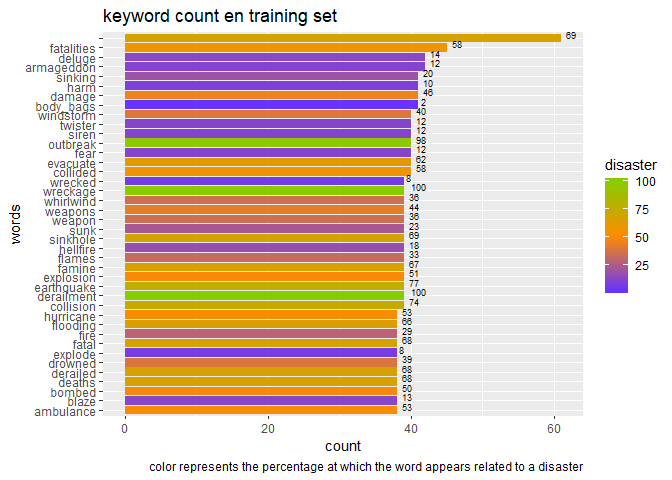<!-- -->


It is useful to observe which are the keywords that are most associated with disasters or non-disasters.

When observing the graph with the count of keywords that appear above 75% of disasters we have that the terms are associated with disasters that normally occur (e.g. outbreak) and related activities (e.g. rescuers).

On the other hand, the count of keywords that appear below 16% of disasters we have that there are many ambiguous terms, this means that a human can associate it with a disaster just by considering the keyword and not the context (e.g. deluge). We also have terms related to feelings of fear (e.g. fear or panicking). This makes it difficult to estimate whether a tweet is a disaster or not with just the keyword.


```r
train %>% mutate(value = 1, target2 = paste0("col_",target)) %>%
   spread(key = target2, value = value, fill = 0) %>% 
   group_by(keyword) %>% summarise(n=n(), disaster=sum(col_1)*100/n) %>% 
   filter(disaster >70) %>% summarise(mean = mean(disaster)) %>% as.numeric() -> mean_1

train %>% mutate(value = 1, target2 = paste0("col_",target)) %>%
   spread(key = target2, value = value, fill = 0) %>% 
   group_by(keyword) %>% summarise(n=n(), disaster=sum(col_1)*100/n) %>% 
   filter(disaster < 30) %>% summarise(mean = mean(disaster)) %>% as.numeric() -> mean_0

train %>% mutate(value = 1, target2 = paste0("col_",target)) %>%
   spread(key = target2, value = value, fill = 0) %>% 
   group_by(keyword) %>% summarise(n=n(), disaster=sum(col_1)*100/n) %>% 
   group_by(disaster) %>% filter(disaster>=mean_1) %>% 
   arrange(desc(n)) %>% #head(40) %>%
   ggplot(aes(x = reorder(keyword,n), y = n, fill = disaster)) + geom_col() +
   scale_fill_gradientn(colours = cols2(20)) +
   geom_text(aes(label = as.character(round(disaster,0))), 
             position = position_dodge(width = 0.9), size=2.5, vjust=0, hjust=-0.5 ,col="black")+
   labs(y = "count", x = "words", title = "keyword count en training set (disaster > 70%)", 
        caption = paste0("color represents the percentage at which the word appears related to a disaster")) +
   coord_flip()
```

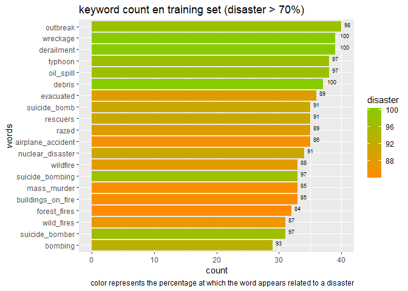<!-- -->

```r
train %>% mutate(value = 1, target2 = paste0("col_",target)) %>%
   spread(key = target2, value = value, fill = 0) %>% 
   group_by(keyword) %>% summarise(n=n(), disaster=sum(col_1)*100/n) %>% 
   group_by(disaster) %>% filter(disaster<=mean_0) %>% 
   arrange(desc(n)) %>% head(40) %>%
   ggplot(aes(x = reorder(keyword,n), y = n, fill = disaster)) + geom_col() +
   scale_fill_gradientn(colours = cols1(20)) +
   geom_text(aes(label = as.character(round(disaster,0))), 
             position = position_dodge(width = 0.9), size=2.5, vjust=0, hjust=-0.5 ,col="black")+
   labs(y = "count", x = "words", title = "keyword count en training set (disaster < 16%)", 
        caption = paste0("color represents the percentage at which the word appears related to a disaster")) +
   coord_flip()
```

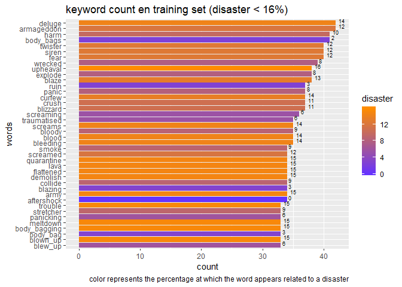<!-- -->


Now we will see if the association of each word with a feeling indicates a relationship with the target. For this we will perform an analysis of feelings of each keyword.

When observing the correlation matrix, a null correlation is observed with each of the sentiments.


```r
emocion.df <- get_nrc_sentiment(char_v = gsub("_", " ", train$keyword), language = "english")
emocion.df <- emocion.df %>% data.frame(target = train$target)

cor(emocion.df) %>% 
   ggcorrplot(lab = TRUE, 
              colors = colorRampPalette(c("darkorange","#88CC00","#6633FF"))(3),
              title = "correlation matrix between keyword sentiments and target",
              legend.title = "Correlation")
```

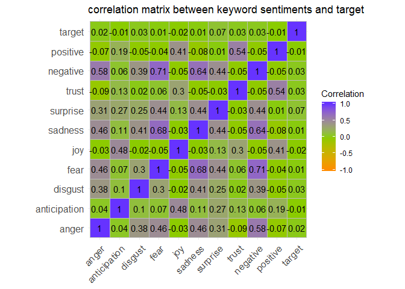<!-- -->

When reviewing in greater detail, we have that most keywords do not have a sentiment associated. The keywords that have a sentiment value associated are associated with negative, fear or sadness, which is quite consistent with the problem, since we try to predict disaster.


```r
train %>% select(keyword, target) %>% cbind(emocion.df %>% select(-target)) %>% 
   gather(key = "sent", value = "nSent", 3:12) %>% mutate(target = target %>% factor) %>% 
   ggplot(aes(x = nSent, fill = target)) + geom_histogram(bins = 10) + 
   scale_fill_manual(values=cols(2)) +
   labs(y = "count observations", x = "count sentiments", title = "keyword count by type of sentiment") +
   facet_wrap(~sent)
```

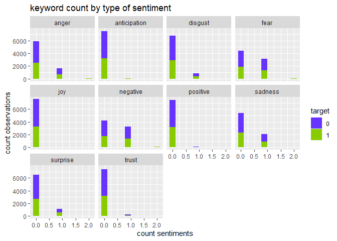<!-- -->


## Location


The **location** represents the location from where the tweet was generated, then the first 10 are shown.


```r
htmlTable(train %>% select(location) %>% unique() %>% head(10),
          caption = "Table 4. location listing.",
          tfoot = paste0("&dagger; 10 locations of ",train %>% select(location) %>% unique() %>% nrow()),
          col.rgroup = c("none","#9999F7"))
```

<table class='gmisc_table' style='border-collapse: collapse; margin-top: 1em; margin-bottom: 1em;' >
<thead>
<tr><td colspan='2' style='text-align: left;'>
Table 4. location listing.</td></tr>
<tr>
<th style='border-bottom: 1px solid grey; border-top: 2px solid grey;'> </th>
<th style='border-bottom: 1px solid grey; border-top: 2px solid grey; text-align: center;'>location</th>
</tr>
</thead>
<tbody>
<tr>
<td style='text-align: left;'>1</td>
<td style='text-align: center;'></td>
</tr>
<tr style='background-color: #9999f7;'>
<td style='background-color: #9999f7; text-align: left;'>2</td>
<td style='background-color: #9999f7; text-align: center;'>Birmingham</td>
</tr>
<tr>
<td style='text-align: left;'>3</td>
<td style='text-align: center;'>Est. September 2012 - Bristol</td>
</tr>
<tr style='background-color: #9999f7;'>
<td style='background-color: #9999f7; text-align: left;'>4</td>
<td style='background-color: #9999f7; text-align: center;'>AFRICA</td>
</tr>
<tr>
<td style='text-align: left;'>5</td>
<td style='text-align: center;'>Philadelphia, PA</td>
</tr>
<tr style='background-color: #9999f7;'>
<td style='background-color: #9999f7; text-align: left;'>6</td>
<td style='background-color: #9999f7; text-align: center;'>London, UK</td>
</tr>
<tr>
<td style='text-align: left;'>7</td>
<td style='text-align: center;'>Pretoria</td>
</tr>
<tr style='background-color: #9999f7;'>
<td style='background-color: #9999f7; text-align: left;'>8</td>
<td style='background-color: #9999f7; text-align: center;'>World Wide!!</td>
</tr>
<tr>
<td style='text-align: left;'>9</td>
<td style='text-align: center;'>Paranaque City</td>
</tr>
<tr style='background-color: #9999f7;'>
<td style='background-color: #9999f7; border-bottom: 2px solid grey; text-align: left;'>10</td>
<td style='background-color: #9999f7; border-bottom: 2px solid grey; text-align: center;'>Live On Webcam</td>
</tr>
</tbody>
<tfoot><tr><td colspan='2'>
&dagger; 10 locations of 3294</td></tr></tfoot>
</table>

There are 3294 locations, some repeated and most with less than 12 observation. This makes this variable not so reliable to make a prediction.


```r
train %>% mutate(value = 1, target2 = paste0("col_",target)) %>%
   spread(key = target2, value = value, fill = 0) %>% 
   group_by(location) %>% summarise(n=n(), disaster=sum(col_1)*100/n) %>% 
   arrange(desc(n)) %>% filter(location!="") %>% head(40) %>%
   ggplot(aes(x = reorder(location,n), y = n, fill = disaster)) + geom_col() +
   scale_fill_gradientn(colours = cols(20)) +
   geom_text(aes(label = as.character(round(disaster,0))), 
             position = position_dodge(width = 0.9), size=2.5, vjust=0, hjust=-0.5 ,col="black")+
   labs(y = "count", x = "words", title = "location count in training set", 
        caption = "color represents the percentage at which the word appears related to a disaster") +
   coord_flip()
```

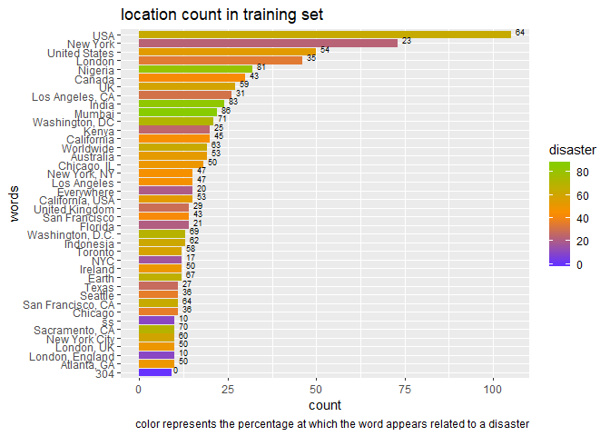<!-- -->


As with **keyword**, it is interesting to review how the **target** variable behaves with respect to **location**.


```r
train %>% mutate(value = 1, target2 = paste0("col_",target)) %>%
   spread(key = target2, value = value, fill = 0) %>% 
   group_by(location) %>% summarise(n=n(), disaster=sum(col_1)*100/n) %>% 
   filter(disaster >=50) %>% summarise(mean = mean(disaster)) %>% as.numeric() -> m_1

train %>% mutate(value = 1, target2 = paste0("col_",target)) %>%
   spread(key = target2, value = value, fill = 0) %>% 
   group_by(location) %>% summarise(n=n(), disaster=sum(col_1)*100/n) %>% 
   filter(disaster < 50) %>% summarise(mean = mean(disaster)) %>% as.numeric() -> m_0

train %>% mutate(value = 1, target2 = paste0("col_",target)) %>%
   spread(key = target2, value = value, fill = 0) %>% 
   group_by(location) %>% summarise(n=n(), disaster=sum(col_1)*100/n) %>% 
   group_by(disaster) %>% filter(disaster>=m_1) %>% 
   arrange(desc(n)) %>% filter(location!="") %>% head(40) %>%
   ggplot(aes(x = reorder(location,n), y = n, fill = disaster)) + geom_col() +
   scale_fill_gradientn(colours = cols2(20)) +
   geom_text(aes(label = as.character(round(disaster,0))), 
             position = position_dodge(width = 0.9), size=2.5, vjust=0, hjust=-0.5 ,col="black")+
   labs(y = "count", x = "words", title = "location count in training set (disaster 100%)", 
        caption = paste0("color represents the percentage at which the word appears related to a disaster")) +
   coord_flip()
```

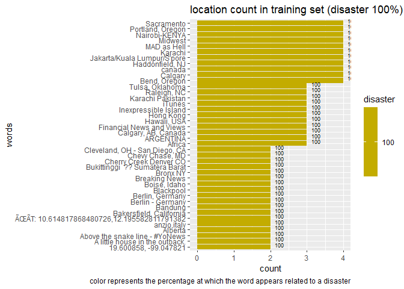<!-- -->


```r
train %>% mutate(value = 1, target2 = paste0("col_",target)) %>%
   spread(key = target2, value = value, fill = 0) %>% 
   group_by(location) %>% summarise(n=n(), disaster=sum(col_1)*100/n) %>% 
   group_by(disaster) %>% filter(disaster<=m_0) %>% 
   arrange(desc(n)) %>% head(40) %>%
   ggplot(aes(x = reorder(location,n), y = n, fill = disaster)) + geom_col() +
   scale_fill_gradientn(colours = cols1(20)) +
   geom_text(aes(label = as.character(round(disaster,0))), 
             position = position_dodge(width = 0.9), size=2.5, vjust=0, hjust=-0.5 ,col="black")+
   labs(y = "count", x = "words", title = "location count in training set (disaster 0%)", 
        caption = paste0("color represents the percentage at which the word appears related to a disaster")) +
   coord_flip()
```

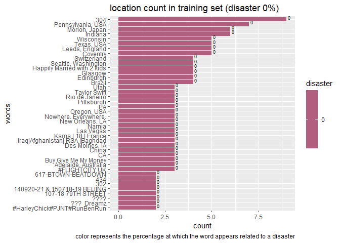<!-- -->


This variable will not be considered to predict disasters, as it may not be reliable because there are nonsense locations (e.g. ??? Dreamz) and there are many locations for the number of observations (3294 of 7613 ~ 43%).

## Text

Now we will review the variable **text** and take advantage of creating auxiliary variables that normally serve to extract useful information from the texts, in this case **nword0** and **nchar0** which are the initial number of words and characters ( before processing the text).


```r
train[,"nword0"] <- sapply(train$text, function(x){length(words(x))})
train[,"nchar0"] <- sapply(train$text, function(x){nchar(x)})

htmlTable(train %>% select(text) %>% head(10),
          caption = "Table 5. text listing.",
          col.rgroup = c("none","#9999F7"))
```

<table class='gmisc_table' style='border-collapse: collapse; margin-top: 1em; margin-bottom: 1em;' >
<thead>
<tr><td colspan='2' style='text-align: left;'>
Table 5. text listing.</td></tr>
<tr>
<th style='border-bottom: 1px solid grey; border-top: 2px solid grey;'> </th>
<th style='border-bottom: 1px solid grey; border-top: 2px solid grey; text-align: center;'>text</th>
</tr>
</thead>
<tbody>
<tr>
<td style='text-align: left;'>1</td>
<td style='text-align: center;'>Our Deeds are the Reason of this #earthquake May ALLAH Forgive us all</td>
</tr>
<tr style='background-color: #9999f7;'>
<td style='background-color: #9999f7; text-align: left;'>2</td>
<td style='background-color: #9999f7; text-align: center;'>Forest fire near La Ronge Sask. Canada</td>
</tr>
<tr>
<td style='text-align: left;'>3</td>
<td style='text-align: center;'>All residents asked to 'shelter in place' are being notified by officers. No other evacuation or shelter in place orders are expected</td>
</tr>
<tr style='background-color: #9999f7;'>
<td style='background-color: #9999f7; text-align: left;'>4</td>
<td style='background-color: #9999f7; text-align: center;'>13,000 people receive #wildfires evacuation orders in California </td>
</tr>
<tr>
<td style='text-align: left;'>5</td>
<td style='text-align: center;'>Just got sent this photo from Ruby #Alaska as smoke from #wildfires pours into a school</td>
</tr>
<tr style='background-color: #9999f7;'>
<td style='background-color: #9999f7; text-align: left;'>6</td>
<td style='background-color: #9999f7; text-align: center;'>#RockyFire Update => California Hwy. 20 closed in both directions due to Lake County fire - #CAfire #wildfires</td>
</tr>
<tr>
<td style='text-align: left;'>7</td>
<td style='text-align: center;'>#flood #disaster Heavy rain causes flash flooding of streets in Manitou, Colorado Springs areas</td>
</tr>
<tr style='background-color: #9999f7;'>
<td style='background-color: #9999f7; text-align: left;'>8</td>
<td style='background-color: #9999f7; text-align: center;'>I'm on top of the hill and I can see a fire in the woods...</td>
</tr>
<tr>
<td style='text-align: left;'>9</td>
<td style='text-align: center;'>There's an emergency evacuation happening now in the building across the street</td>
</tr>
<tr style='background-color: #9999f7;'>
<td style='background-color: #9999f7; border-bottom: 2px solid grey; text-align: left;'>10</td>
<td style='background-color: #9999f7; border-bottom: 2px solid grey; text-align: center;'>I'm afraid that the tornado is coming to our area...</td>
</tr>
</tbody>
</table>


Now we proceed to clean the text, we will do this according to the following:

- Eliminate punctuation marks.
- Remove web pages.
- Delete numbers.
- Eliminate line breaks.
- Remove single letters.
- Remove stopwords.
- Remove extra spaces.
- Transform to lower case.

In addition, 4 more auxiliary variables will be created, **nword1**, **nchar1**, **rel_0** and **rel_1**, where the first 2 are the final number of words and characters, and the second 2 are the relationship between the number of words and the number of initial and final characters respectively.


```r
train <- train %>% mutate(text = gsub("[[:punct:]]"," ",text),
                          text =gsub("http "," ",text),
                          text = gsub("https "," ",text),
                          text =gsub("com "," ",text),
                          text = gsub("co "," ",text),
                          text =gsub("org "," ",text),
                          text = gsub("\\w*[0-9]+\\w*\\s*", " ",text),
                          text = gsub("\\n", " ",text),
                          text = removeWords(text, letters),
                          text = stringr::str_replace_all(text," $", ""),
                          text = tolower(text),
                          text = removeWords(text, stopwords("english")),
                          text = stripWhitespace(text),
                          text = stringr::str_replace_all(text,"^ ", ""))

train[,"nword1"] <- sapply(train$text, function(x){length(words(x))})
train[,"nchar1"] <- sapply(train$text, function(x){nchar(x)})
train <- train %>% mutate(rel_0 = nword0/nchar0, rel_1 = nword1/nchar1)

htmlTable(train %>% select(text) %>% head(10),
          caption = "Table 6. text listing (after processing).",
          col.rgroup = c("none","#9999F7"))
```

<table class='gmisc_table' style='border-collapse: collapse; margin-top: 1em; margin-bottom: 1em;' >
<thead>
<tr><td colspan='2' style='text-align: left;'>
Table 6. text listing (after processing).</td></tr>
<tr>
<th style='border-bottom: 1px solid grey; border-top: 2px solid grey;'> </th>
<th style='border-bottom: 1px solid grey; border-top: 2px solid grey; text-align: center;'>text</th>
</tr>
</thead>
<tbody>
<tr>
<td style='text-align: left;'>1</td>
<td style='text-align: center;'>deeds reason earthquake may allah forgive us </td>
</tr>
<tr style='background-color: #9999f7;'>
<td style='background-color: #9999f7; text-align: left;'>2</td>
<td style='background-color: #9999f7; text-align: center;'>forest fire near la ronge sask canada</td>
</tr>
<tr>
<td style='text-align: left;'>3</td>
<td style='text-align: center;'>residents asked shelter place notified officers evacuation shelter place orders expected</td>
</tr>
<tr style='background-color: #9999f7;'>
<td style='background-color: #9999f7; text-align: left;'>4</td>
<td style='background-color: #9999f7; text-align: center;'>people receive wildfires evacuation orders california</td>
</tr>
<tr>
<td style='text-align: left;'>5</td>
<td style='text-align: center;'>just got sent photo ruby alaska smoke wildfires pours school</td>
</tr>
<tr style='background-color: #9999f7;'>
<td style='background-color: #9999f7; text-align: left;'>6</td>
<td style='background-color: #9999f7; text-align: center;'>rockyfire update california hwy closed directions due lake county fire cafire wildfires</td>
</tr>
<tr>
<td style='text-align: left;'>7</td>
<td style='text-align: center;'>flood disaster heavy rain causes flash flooding streets manitou colorado springs areas</td>
</tr>
<tr style='background-color: #9999f7;'>
<td style='background-color: #9999f7; text-align: left;'>8</td>
<td style='background-color: #9999f7; text-align: center;'>top hill can see fire woods </td>
</tr>
<tr>
<td style='text-align: left;'>9</td>
<td style='text-align: center;'>emergency evacuation happening now building across street</td>
</tr>
<tr style='background-color: #9999f7;'>
<td style='background-color: #9999f7; border-bottom: 2px solid grey; text-align: left;'>10</td>
<td style='background-color: #9999f7; border-bottom: 2px solid grey; text-align: center;'>afraid tornado coming area </td>
</tr>
</tbody>
</table>

These new variables have a low correlation with **target**, although higher than those obtained using information from **keyword**.

Looking at the **1-grams** we see that the words associated with disasters are some kind of disaster and tasks associated with disasters.

In the case of the **2-grams** and **3-grams** we have the same thing as in the case of the **1-grams** and also a temporal context is appreciated, that is, the Tweets were written when there was a fire in California or a disaster in Malasya.


```r
cor(train %>% 
       select(nword0, nword1, nchar0, nchar1, rel_0, rel_1, target) %>% 
       mutate(target = as.numeric(as.character(target)))) %>% 
   ggcorrplot(lab = TRUE, 
              colors = colorRampPalette(c("darkorange","#88CC00","#6633FF"))(3),
              title = "correlation matrix between new variables and target",
              legend.title = "Correlation")
```

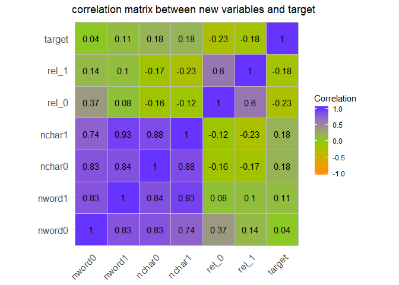<!-- -->

```r
train %>% select(nword0, nword1, nchar0, nchar1, rel_0, rel_1, target) %>% 
   gather(key = "Variable", value = "nVariable", 1:2) %>% mutate(target = target %>% factor) %>% 
   ggplot(aes(x = nVariable, fill = target)) + geom_histogram(bins = 30) + 
   scale_fill_manual(values=cols(2)) +
   labs(y = "count observations", x = "count nWords", title = "text count by number of words") +
   facet_wrap(~Variable)
```

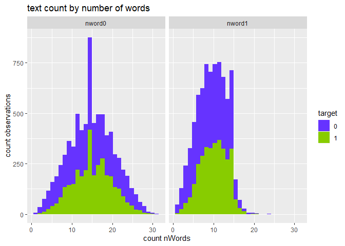<!-- -->

```r
train %>% select(nword0, nword1, nchar0, nchar1, rel_0, rel_1, target) %>% 
   gather(key = "Variable", value = "nVariable", 3:4) %>% mutate(target = target %>% factor) %>% 
   ggplot(aes(x = nVariable, fill = target)) + geom_histogram(bins = 30) + 
   scale_fill_manual(values=cols(2)) +
   labs(y = "count observations", x = "count nChar", title = "text count by number of chars") +
   facet_wrap(~Variable)
```

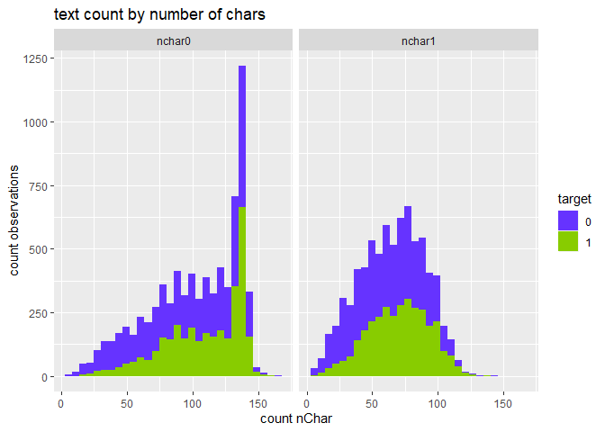<!-- -->

```r
train %>% select(nword0, nword1, nchar0, nchar1, rel_0, rel_1, target) %>% 
   gather(key = "Variable", value = "nVariable", 5:6) %>% mutate(target = target %>% factor) %>% 
   ggplot(aes(x = nVariable, fill = target)) + geom_histogram(bins = 30) + 
   scale_fill_manual(values=cols(2)) +
   labs(y = "count observations", x = "count nRel", title = "text count by relation between number of words ans chars") +
   facet_wrap(~Variable)
```

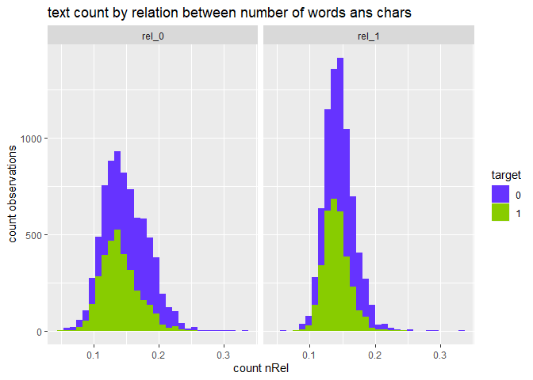<!-- -->

Looking at the detail of the distributions we have that it is not very clear a separation between desaster / not desaster.

Next we will perform a sentiment analysis of the **text** variable to check if we can extract any relationship with **target**.


```r
emocion.df2 <- get_nrc_sentiment(char_v = train$text, language = "english")
emocion.df2 <- emocion.df2 %>% data.frame(target = train$target)

cor(emocion.df2) %>% 
   ggcorrplot(lab = TRUE, 
              colors = colorRampPalette(c("darkorange","#88CC00","#6633FF"))(3),
              title = "correlation matrix between text sentiments and target",
              legend.title = "Correlation")
```

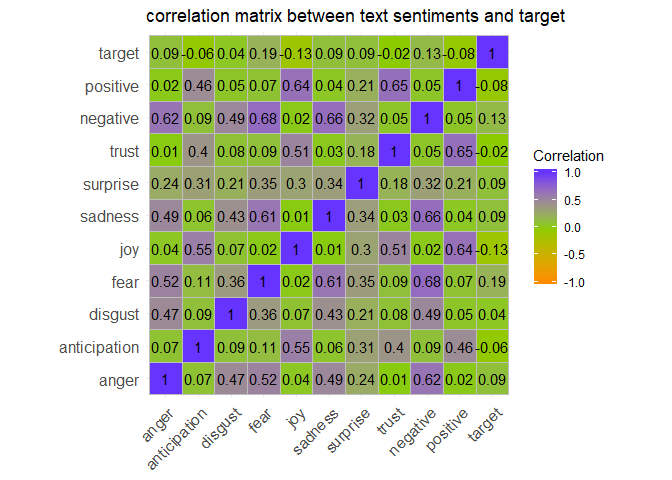<!-- -->

The correlation between text and target sentiments is low, observing the distribution detail we have that the variables **fear** and **negative** of text could be useful, since in the other sentiments they have very few different values of 0.


```r
train %>% select(text, target) %>% cbind(emocion.df2 %>% select(-target)) %>% 
   gather(key = "sent", value = "nSent", 3:12) %>% mutate(target = target %>% factor) %>% 
   ggplot(aes(x = nSent, fill = target)) + geom_histogram(bins = 30) + 
   scale_fill_manual(values=cols(2)) +
   labs(y = "count observations", x = "count sentiments", title = "text count by type of sentiment") +
   facet_wrap(~sent)
```

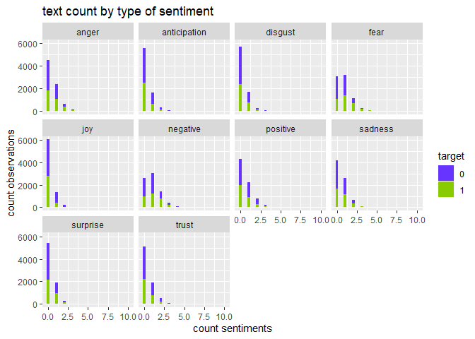<!-- -->


Now we will tokenize the observations to be able to work with them, eliminating the less common words.


```r
token1gram <- function(x) {
   unlist(lapply(NLP::ngrams(words(x), 1), paste, collapse = " "),
          use.names = FALSE)}
token2gram <- function(x) {
   unlist(lapply(NLP::ngrams(words(x), 2), paste, collapse = " "),
          use.names = FALSE)}
token3gram <- function(x) {
   unlist(lapply(NLP::ngrams(words(x), 3), paste, collapse = " "),
          use.names = FALSE)}


dtm <- train$text %>% VectorSource() %>% VCorpus() %>%
   DocumentTermMatrix(control = list(removeNumbers = TRUE, stopwords = TRUE,
                                     stemming = TRUE, tokenize = token1gram)) %>%
   removeSparseTerms(1-(1-0.995)/1) %>% as.matrix() %>% as.data.frame() %>% cbind(target = train$target)

dtm2 <- train$text %>% VectorSource() %>% VCorpus() %>%
   DocumentTermMatrix(control = list(removeNumbers = TRUE, stopwords = TRUE,
                                     stemming = TRUE, tokenize = token2gram)) %>%
   removeSparseTerms(1-(1-0.995)/3) %>% as.matrix() %>% as.data.frame() %>% cbind(target = train$target)

dtm3 <- train$text %>% VectorSource() %>% VCorpus() %>%
   DocumentTermMatrix(control = list(removeNumbers = TRUE, stopwords = TRUE,
                                     stemming = TRUE, tokenize = token3gram)) %>%
   removeSparseTerms(1-(1-0.995)/5) %>% as.matrix() %>% as.data.frame() %>% cbind(target = train$target)


col_dtm <- data.frame(word = colnames(dtm), colsum = colSums(dtm), 
                      disaster = colSums(dtm*dtm$target)*100/colSums(dtm), row.names = NULL)

col_dtm %>% arrange(desc(colsum)) %>% filter(word != "target") %>% head(40) %>% 
   ggplot(aes(x = reorder(word,colsum), y = colsum, fill = disaster)) + geom_col() +
   scale_fill_gradientn(colours = cols(20)) +
   geom_text(aes(label = as.character(round(disaster,0))), 
             position = position_dodge(width = 0.9), size=2.5, vjust=0, hjust=-0.5 ,col="black")+
   labs(y = "count", x = "1-grams", title = "1-grams count in training set", 
        caption = "color represents the percentage at which the word appears related to a disaster") +
   coord_flip()
```

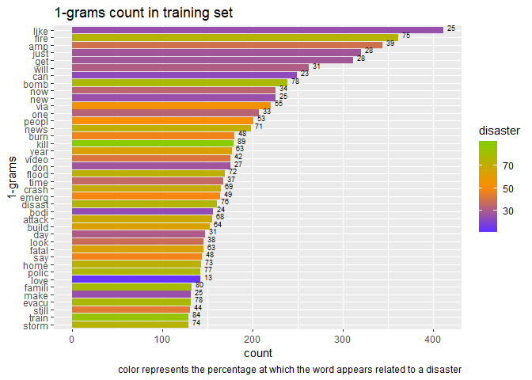<!-- -->


```r
col_dtm %>% arrange(desc(colsum)) %>% filter(word != "target") %>% 
   filter(disaster >= 75) %>% head(40) %>% 
   ggplot(aes(x = reorder(word,colsum), y = colsum, fill = disaster)) + geom_col() +
   scale_fill_gradientn(colours = cols2(20)) +
   geom_text(aes(label = as.character(round(disaster,0))), 
             position = position_dodge(width = 0.9), size=2.5, vjust=0, hjust=-0.5 ,col="black")+
   labs(y = "count", x = "1-grams", title = "1-grams count in training set (disaster > 75%)", 
        caption = "color represents the percentage at which the word appears related to a disaster") +
   coord_flip()
```

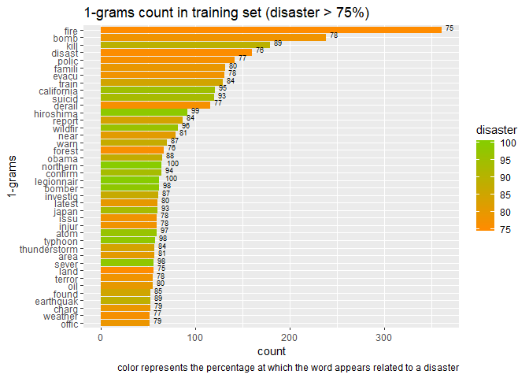<!-- -->


```r
col_dtm %>% arrange(desc(colsum)) %>% filter(word != "target") %>% 
   filter(disaster <= 25) %>% head(40) %>% 
   ggplot(aes(x = reorder(word,colsum), y = colsum, fill = disaster)) + geom_col() +
   scale_fill_gradientn(colours = cols1(20)) +
   geom_text(aes(label = as.character(round(disaster,0))), 
             position = position_dodge(width = 0.9), size=2.5, vjust=0, hjust=-0.5 ,col="black")+
   labs(y = "count", x = "1-grams", title = "1-grams count in training set (disaster <25%)", 
        caption = "color represents the percentage at which the word appears related to a disaster") +
   coord_flip()
```

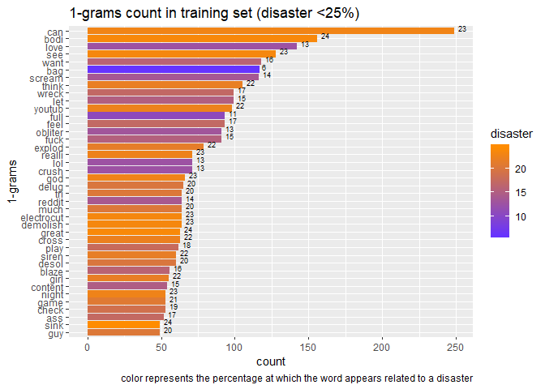<!-- -->


```r
col_dtm2 <- data.frame(word = colnames(dtm2),colsum = colSums(dtm2), 
                       disaster = colSums(dtm2*dtm2$target)*100/colSums(dtm2), row.names = NULL)

col_dtm2 %>% arrange(desc(colsum)) %>% filter(word != "target") %>% head(40) %>% 
   ggplot(aes(x = reorder(word,colsum), y = colsum, fill = disaster)) + geom_col() +
   scale_fill_gradientn(colours = cols(20)) +
   geom_text(aes(label = as.character(round(disaster,0))), 
             position = position_dodge(width = 0.9), size=2.5, vjust=0, hjust=-0.5 ,col="black")+
   labs(y = "count", x = "2-grams", title = "2-grams count in training set", 
        caption = "color represents the percentage at which the words appears related to a disaster") +
   coord_flip()
```

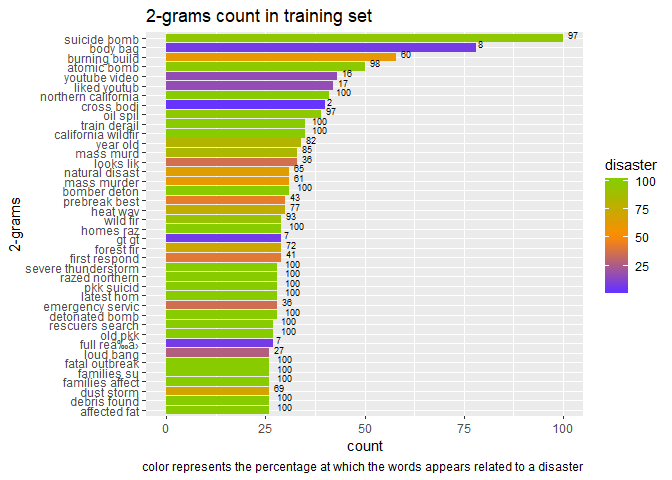<!-- -->


```r
col_dtm2 %>% arrange(desc(colsum)) %>% filter(word != "target") %>% 
   filter(disaster >= 75) %>% head(40) %>% 
   ggplot(aes(x = reorder(word,colsum), y = colsum, fill = disaster)) + geom_col() +
   scale_fill_gradientn(colours = cols2(20)) +
   geom_text(aes(label = as.character(round(disaster,0))), 
             position = position_dodge(width = 0.9), size=2.5, vjust=0, hjust=-0.5 ,col="black")+
   labs(y = "count", x = "2-grams", title = "2-grams count in training set (disaster > 75%)", 
        caption = "color represents the percentage at which the words appears related to a disaster") +
   coord_flip()
```

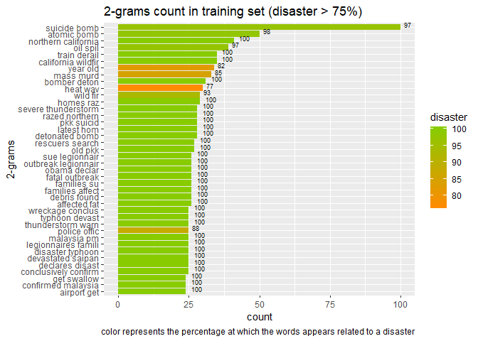<!-- -->


```r
col_dtm2 %>% arrange(desc(colsum)) %>% filter(word != "target") %>% 
   filter(disaster <= 25) %>% head(40) %>% 
   ggplot(aes(x = reorder(word,colsum), y = colsum, fill = disaster)) + geom_col() +
   scale_fill_gradientn(colours = cols1(20)) +
   geom_text(aes(label = as.character(round(disaster,0))), 
             position = position_dodge(width = 0.9), size=2.5, vjust=0, hjust=-0.5 ,col="black")+
   labs(y = "count", x = "2-grams", title = "2-grams count in training set (disaster < 25%)", 
        caption = "color represents the percentage at which the words appears related to a disaster") +
   coord_flip()
```

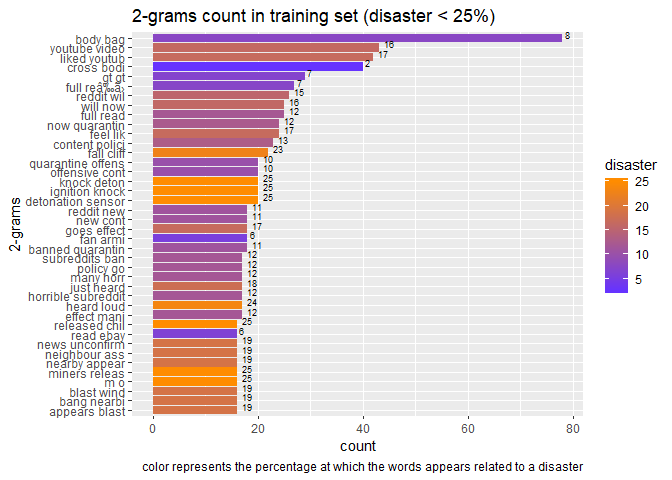<!-- -->


```r
col_dtm3 <- data.frame(word = colnames(dtm3),colsum = colSums(dtm3), 
                       disaster = colSums(dtm3*dtm3$target)*100/colSums(dtm3), row.names = NULL)

col_dtm3 %>% arrange(desc(colsum)) %>% filter(word != "target") %>% head(40) %>% 
   ggplot(aes(x = reorder(word,colsum), y = colsum, fill = disaster)) + geom_col() +
   scale_fill_gradientn(colours = cols(20)) +
   geom_text(aes(label = as.character(round(disaster,0))), 
             position = position_dodge(width = 0.9), size=2.5, vjust=0, hjust=-0.5 ,col="black")+
   labs(y = "count", x = "3-grams", title = "3-grams count in training set", 
        caption = "color represents the percentage at which the words appears related to a disaster") +
   coord_flip()
```

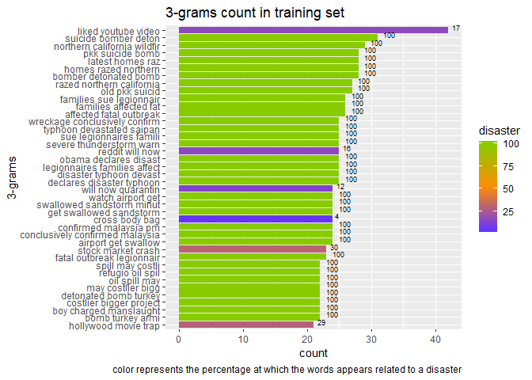<!-- -->


```r
col_dtm3 %>% arrange(desc(colsum)) %>% filter(word != "target") %>% 
   filter(disaster >= 75) %>% head(40) %>% 
   ggplot(aes(x = reorder(word,colsum), y = colsum, fill = disaster)) + geom_col() +
   scale_fill_gradientn(colours = cols2(20)) +
   geom_text(aes(label = as.character(round(disaster,0))), 
             position = position_dodge(width = 0.9), size=2.5, vjust=0, hjust=-0.5 ,col="black")+
   labs(y = "count", x = "3-grams", title = "3-grams count in training set (disaster > 75%)", 
        caption = "color represents the percentage at which the words appears related to a disaster") +
   coord_flip()
```

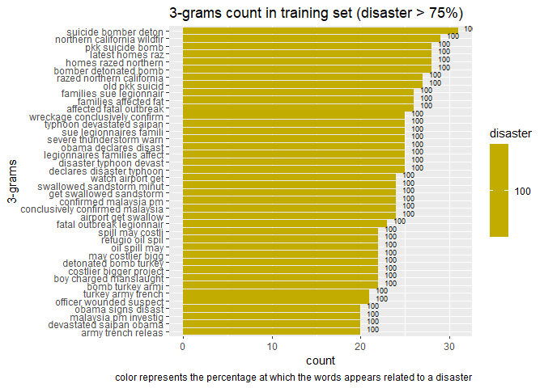<!-- -->


```r
col_dtm3 %>% arrange(desc(colsum)) %>% filter(word != "target") %>% 
   filter(disaster <= 25) %>% head(40) %>% 
   ggplot(aes(x = reorder(word,colsum), y = colsum, fill = disaster)) + geom_col() +
   scale_fill_gradientn(colours = cols1(20)) +
   geom_text(aes(label = as.character(round(disaster,0))), 
             position = position_dodge(width = 0.9), size=2.5, vjust=0, hjust=-0.5 ,col="black")+
   labs(y = "count", x = "3-grams", title = "3-grams count in training set (disaster < 25%)", 
        caption = "color represents the percentage at which the words appears related to a disaster") +
   coord_flip()
```

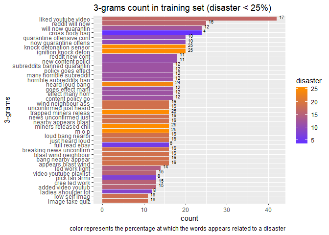<!-- -->


# Predictions

## Split data set

After all the previously performed analyzes, the variables are as follows:

- **nword0**: word count of the original variable **text ** before processing.
- **nword1**: word count of the original variable **text ** after processing.
- **nchar0**: character count of the original variable **text ** before processing.
- **nchar1**: character count of the original variable **text ** after processing.
- **rel_0**: relationship between **nword0** and **nchar0**.
- **rel_1**: relationship between **nword1** and **nchar1**.
- **key_x**: each of the **keywords**. In total there are 221 variables. *x* represents each of the **keywords**
- **keyword_sent**: each of the sentiments associated with the **keywords**. In total there are 10 variables associated with sentiments.
- **text_sent**: each of the sentiments associated with the variable **text**. In total there are 10 variables associated with sentiments.
- **1-grams**: 1-grams with less sparse than the variable **text**. There are 327 variables.
- **2-grams**: 2-grams with less sparse than the variable **text**. They are 242 variables.
- **3-grams**: 3-grams with less sparse than the variable **text**. There are 305 variables.
- **target**: variable **original** target.

When dividing the dataset, it is considered a training and test set with 70% and 30% of the original respectively.


```r
emocion.df <- emocion.df %>% select(-target)
colnames(emocion.df) <- paste0("keyword_", colnames(emocion.df))
emocion.df2 <- emocion.df2 %>% select(-target)
colnames(emocion.df2) <- paste0("text_", colnames(emocion.df2))


train <- train %>% mutate(id_value = 1, keyword = paste0("key_", keyword)) %>%
   spread(key = keyword, value = id_value, fill = 0) %>% select(-id, -location, -text, -key_) %>% 
   cbind(dtm %>% select(-target), dtm2 %>% select(-target), dtm3 %>% select(-target),
         emocion.df, emocion.df2) %>% mutate(target = factor(target))

set.seed(100)
Index <- createDataPartition(y = train$target, p = 0.8, list = FALSE)

levels(train$target) <- paste0("X",levels(train$target))

table <- data.frame(rows = c(nrow(train[Index,]),
                             nrow(train[-Index,])),
                    cols = c(ncol(train[Index,]),
                             ncol(train[-Index,])),
                    row.names = c("trainset", "testset")
                    )

htmlTable(table,
          caption = "Table 7. train and test set dimensions.",
          col.rgroup = c("none","#9999F7"))
```

<table class='gmisc_table' style='border-collapse: collapse; margin-top: 1em; margin-bottom: 1em;' >
<thead>
<tr><td colspan='3' style='text-align: left;'>
Table 7. train and test set dimensions.</td></tr>
<tr>
<th style='border-bottom: 1px solid grey; border-top: 2px solid grey;'> </th>
<th style='border-bottom: 1px solid grey; border-top: 2px solid grey; text-align: center;'>rows</th>
<th style='border-bottom: 1px solid grey; border-top: 2px solid grey; text-align: center;'>cols</th>
</tr>
</thead>
<tbody>
<tr>
<td style='text-align: left;'>trainset</td>
<td style='text-align: center;'>6091</td>
<td style='text-align: center;'>1122</td>
</tr>
<tr style='background-color: #9999f7;'>
<td style='background-color: #9999f7; border-bottom: 2px solid grey; text-align: left;'>testset</td>
<td style='background-color: #9999f7; border-bottom: 2px solid grey; text-align: center;'>1522</td>
<td style='background-color: #9999f7; border-bottom: 2px solid grey; text-align: center;'>1122</td>
</tr>
</tbody>
</table>

## Model

For the predictions, a **xgbTree** model will be used according to the **ROC** metric.

The hyperparameters of the model are:

- *cross validation* with 5 folds.
- search *random* with 50 random points per fold.
- sampling *up* and preprocessing of *center* and *scale*.


```r
fitControl <- trainControl(method = "cv",
                           number = 5,
                           search = "random",
                           summaryFunction = twoClassSummary,
                           classProbs = TRUE,
                           sampling = "up",
                           verboseIter = FALSE
                           )

set.seed(100)
model <- train(target ~ .,
               data = train[Index,],
               preProcess = c("center", "scale"),
               method = "xgbTree",
               trControl = fitControl,
               metric = "ROC",
               tuneLength = 50,
               verbose = FALSE
               )

ggplot(model) + ggtitle("Results of the xgbTree model")+
   geom_point(colour = "#6633FF")
```

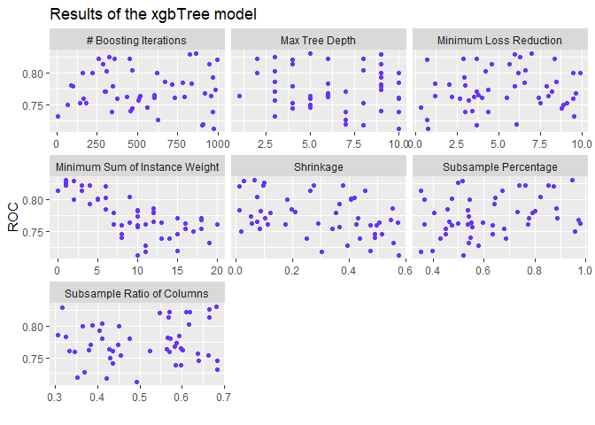<!-- -->

The model delivers good results of the **ROC** metric in a range between 0.7 and 0.83.

The most significant variables are those created from the number of words and characters, as well as some related to the analysis of feelings. The importance of the variable **rel_0** is remarkable. So in order to identify a desaster, the relationship between the number of words and the length of each word is important.

When observing the results of the confusion matrix we have very similar results so we can rule out overfitting.


```r
model %>% varImp() %>% plot(top=40)
```

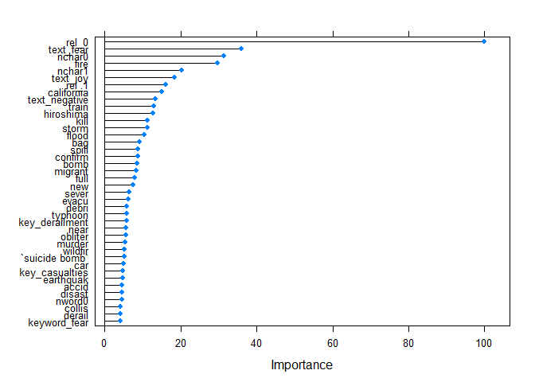<!-- -->

```r
confusionMatrix(predict(model, newdata = train[Index,]), train[Index,]$target)
```

```
Confusion Matrix and Statistics

          Reference
Prediction   X0   X1
        X0 2958  639
        X1  516 1978
                                          
               Accuracy : 0.8104          
                 95% CI : (0.8003, 0.8202)
    No Information Rate : 0.5703          
    P-Value [Acc > NIR] : < 2.2e-16       
                                          
                  Kappa : 0.6108          
                                          
 Mcnemar's Test P-Value : 0.0003309       
                                          
            Sensitivity : 0.8515          
            Specificity : 0.7558          
         Pos Pred Value : 0.8224          
         Neg Pred Value : 0.7931          
             Prevalence : 0.5703          
         Detection Rate : 0.4856          
   Detection Prevalence : 0.5905          
      Balanced Accuracy : 0.8036          
                                          
       'Positive' Class : X0              
                                          
```

```r
confusionMatrix(predict(model, newdata = train[-Index,]), train[-Index,]$target)
```

```
Confusion Matrix and Statistics

          Reference
Prediction  X0  X1
        X0 721 175
        X1 147 479
                                         
               Accuracy : 0.7884         
                 95% CI : (0.767, 0.8087)
    No Information Rate : 0.5703         
    P-Value [Acc > NIR] : <2e-16         
                                         
                  Kappa : 0.566          
                                         
 Mcnemar's Test P-Value : 0.1324         
                                         
            Sensitivity : 0.8306         
            Specificity : 0.7324         
         Pos Pred Value : 0.8047         
         Neg Pred Value : 0.7652         
             Prevalence : 0.5703         
         Detection Rate : 0.4737         
   Detection Prevalence : 0.5887         
      Balanced Accuracy : 0.7815         
                                         
       'Positive' Class : X0             
                                         
```
